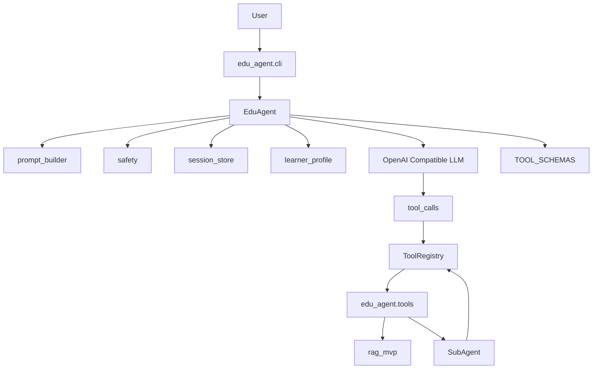
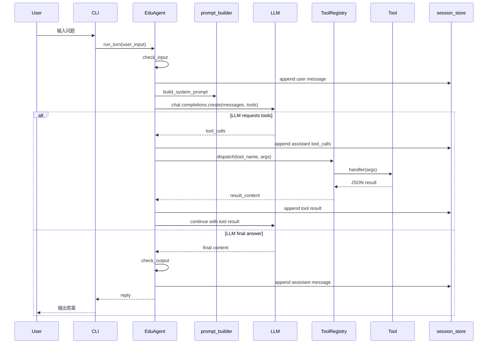
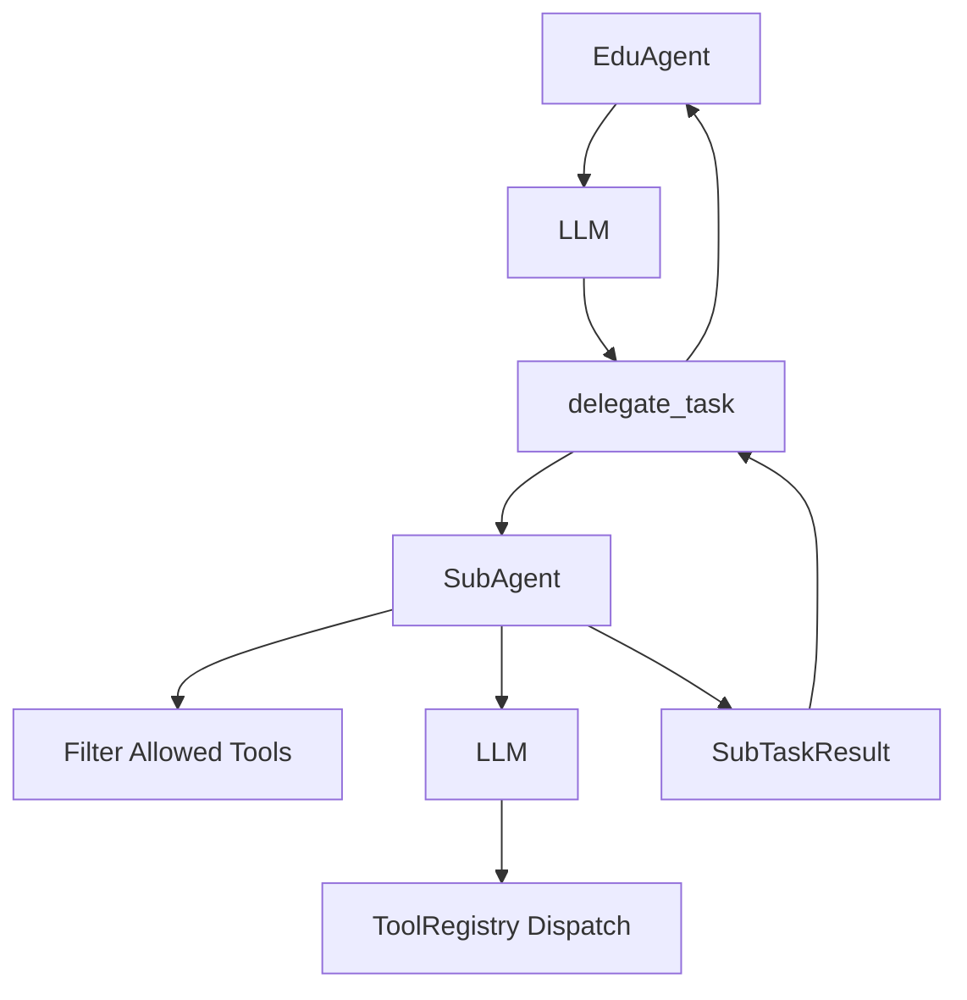

下面是基于当前代码生成的项目架构文档草案。

# EduAgent 项目架构文档

## 1. 项目定位

当前仓库包含两个主要 Python 包：

- `edu_agent`：面向教学场景的对话式 Agent，负责 CLI 交互、LLM ReAct 循环、工具调用、技能加载、子 Agent 委派、会话与学习者画像管理。
- `rag_mvp`：底层 RAG / 文档解析 / 题目生成 / 思维导图能力提供方，供 `edu_agent` 的工具层调用。

项目入口在 `pyproject.toml`：

- `edu = "edu_agent.cli:cli"`
- `rag = "rag_mvp.cli:cli"`
- `parse = "rag_mvp.cli:parse"`
- `mindmap = "rag_mvp.mindmap_cli:cli"`

## 2. 顶层调用关系

## 3. 核心模块结构

### 3.1 CLI 层：`edu_agent.cli`

主要职责：

- 定义 `edu chat` 交互命令。
- 构造 `AgentConfig`。
- 初始化 `EduAgent`。
- 为流式输出、思考状态、工具调用进度构造 `AgentCallbacks`。
- 支持交互指令：
  - `/quit`、`/exit`：退出
  - `/reset`：清空当前会话内存
  - `/verbose`：切换工具进度展示模式
- 可选启动 `CronDaemon`。

关键函数 / 类：

- `cli()`：Click 根命令。
- `chat(...)`：交互式聊天主循环。
- `build_callbacks(mode)`：构造事件回调。
- `Spinner`：CLI 思考中动画。

### 3.2 Agent 主循环：`edu_agent.agent`

核心类：`EduAgent`

职责：

- 维护当前会话内存 `self.messages`。
- 初始化 LLM 客户端。
- 加载技能、学习者画像、内置工具与脚本型技能工具。
- 执行单轮 ReAct 循环。
- 在输入和输出阶段做安全检查。
- 将用户消息、助手消息、工具调用消息持久化到 JSONL。

关键方法：

- `__init__(config)`
  - 调用 `discover_builtin_tools()` 注册内置工具。
  - 加载 `AgentConfig`。
  - 从 `rag_mvp.config.settings` 读取 LLM 配置。
  - 调用 `load_skill_entries()` 加载技能。
  - 调用 `load_profile()` 和 `profile_summary()` 加载学习者画像摘要。
  - 调用 `discover_and_register()` 将脚本型技能注册为工具。

- `run_turn(user_input)`
  - 输入安全检查。
  - 追加用户消息。
  - 构造 system prompt。
  - 循环调用 LLM。
  - 如果 LLM 返回 `tool_calls`，执行工具并继续下一轮。
  - 如果 LLM 返回最终文本，做输出安全检查并返回。
  - 超过最大迭代次数时返回预算耗尽提示。

- `_llm_call(system_prompt)`
  - 根据是否配置 `on_text_chunk` 决定走流式或非流式。
  - 传入 `TOOL_SCHEMAS` 给 LLM function calling。

- `_handle_tool_calls_from_stream(tool_calls)`
  - 将 assistant tool-call 消息写入历史。
  - 解析参数。
  - 通过 `registry.dispatch()` 执行工具。
  - 将 tool 角色结果写入历史。

### 3.3 配置与数据类型：`edu_agent.types`

核心数据结构：

- `AgentConfig`
  - `model`
  - `max_iterations`
  - `user_id`
  - `session_id`
  - `skills_dir`
  - `profile_storage_dir`
  - `session_storage_dir`

- `AgentCallbacks`
  - `on_thinking_start`
  - `on_thinking_end`
  - `on_tool_start`
  - `on_tool_end`
  - `on_text_chunk`
  - `was_streamed`

- `ToolResult`
  - 工具执行的标准结果结构。

- `SubAgentConfig`
  - 子任务描述、工具白名单、最大迭代次数、模型、system prompt。

- `SubTaskResult`
  - 子 Agent 返回结果。

## 4. 工具系统

### 4.1 工具注册中心：`edu_agent.registry`

核心类：`ToolRegistry`

职责：

- 保存所有可调用工具。
- 将工具 schema 转换为 OpenAI function calling 格式。
- 提供统一分发入口。
- 捕获工具异常，保证工具调用不会向上抛出未处理异常。

关键函数 / 方法：

- `registry.register(...)`
  - 注册工具名、schema、handler、toolset、描述等信息。

- `registry.get_tool_definitions()`
  - 返回 LLM 可见的工具 schema 列表。

- `registry.dispatch(name, args)`
  - 执行指定工具。
  - 返回 JSON 字符串。

- `discover_builtin_tools()`
  - 扫描 `edu_agent/tools/*.py`。
  - 只导入存在顶层 `registry.register(...)` 的模块。
  - 导入模块时触发工具注册。

### 4.2 工具包入口：`edu_agent.tools.__init__`

职责：

- 提供全局 `TOOL_SCHEMAS`。
- 提供 `execute_tool(name, args)` 兼容调用入口。
- 初始化时自动发现内置工具并同步 schema。

关键函数：

- `refresh_tool_schemas()`
- `execute_tool(name, args)`

### 4.3 内置工具模块

当前内置工具按能力拆分：

- `tools.rag`
  - `knowledge_query`：查询 RAG 知识库。
  - `generate_quiz`：基于知识库生成题目。
  - `ingest_document`：导入文档到知识库。
  - `build_mindmap`：生成思维导图。

- `tools.ocr`
  - `parse_document`：调用 MinerU / RAGAnything 解析 PDF、图片、Word 等文档。

- `tools.eval`
  - `hint_generator`：生成分级提示。
  - `score_essay`：评分书面作答。
  - `evaluate_code`：评估代码作业。

- `tools.search`
  - `web_search`：Tavily / DuckDuckGo 搜索。
  - `web_fetch`：抓取网页正文。
  - `ollama_web_search`：调用 Ollama Web Search API。
  - `wikipedia_search`：查询维基百科。

- `tools.skills`
  - `list_skills`：列出技能。
  - `view_skill`：查看技能正文或附件。
  - `manage_skill`：创建或编辑技能文件。

- `tools.files`
  - `write_file`：写入 `output/` 下文件。
  - `read_file`：读取 `output/` 下文件。

- `tools.delegation`
  - `delegate_task`：将复杂任务委派给隔离子 Agent。

- `tools.scheduling`
  - `cron_job`：创建、列出、删除、触发定时任务。

## 5. ReAct 主流程

## 6. Prompt 与技能系统

### 6.1 Prompt 构建：`edu_agent.prompt_builder`

核心函数：`build_system_prompt(...)`

Prompt 分层：

1. Persona
   - 优先注入 `always_inject` 技能。
   - 如果没有 `EDUCATOR` 技能，则使用内置默认教学助手 persona。

2. Skills Index
   - 将非 always-inject 技能以 `<available_skills>` 形式注入。
   - 这里只暴露技能名称和描述，不直接注入完整正文。

3. Learner Profile
   - 注入学习者画像摘要。

4. Safety Block
   - 注入固定安全准则。

5. Tool Guidance
   - 告诉模型何时应调用知识库、题目生成、技能查看等工具。

### 6.2 技能加载：`edu_agent.skills_loader`

核心类型：`SkillEntry`

支持两种技能格式：

- 平铺格式：`skills/{name}.md`
- 目录格式：`skills/{name}/SKILL.md`

支持 frontmatter 字段：

- `name`
- `description`
- `version`
- `always_inject`
- `requires_tools`
- `requires_env`
- `requires_config`
- `platforms`

关键函数：

- `load_skill_entries(skills_dir)`
- `load_all_skills(skills_dir)`
- `load_skill(path)`
- `read_skill_file(skill_dir, file_path)`
- `invalidate_cache()`

### 6.3 脚本型技能工具：`edu_agent.skill_tool_registry`

职责：

- 扫描目录型技能下的 `scripts/*.py`。
- 寻找 `search()` 或 `run()` 入口函数。
- 根据函数签名推导 JSON Schema。
- 将脚本注册为 LLM 可调用工具。
- 注册后刷新 `TOOL_SCHEMAS`。

安全限制：

- 禁止脚本中出现 `os.system`、`subprocess`、`eval`、`exec`、`open`、`socket`、`pickle` 等危险模式。
- 加载失败或安全检查失败时跳过该脚本，不中断 Agent 初始化。

## 7. 子 Agent 委派机制

核心模块：`edu_agent.subagent`

核心类：`SubAgent`

设计特征：

- 独立上下文，不继承主 Agent 的消息历史。
- 工具白名单，只允许调用 `SubAgentConfig.allowed_tools` 中的工具。
- 禁止递归委派，子 Agent 不能再调用 `delegate_task`。
- 使用模块级信号量限制最大并发数，当前为 4。
- 同步执行，返回 `SubTaskResult`。

调用入口：

- 主 Agent 不直接调用 `SubAgent`。
- LLM 通过 `delegate_task` 工具间接触发。
- `tools.delegation._handle_delegate_task()` 构造 `SubAgentConfig` 并调用 `SubAgent().run(cfg)`。

## 8. 会话与学习者画像

### 8.1 会话存储：`edu_agent.session_store`

职责：

- 将会话消息追加写入 JSONL。
- 每个 session 一个文件。
- 支持 OpenAI 风格消息，包括 `tool_calls` 和 `tool` 角色消息。

关键函数：

- `append_message(session_id, user_id, message, storage_dir)`
- `append_turn(...)`
- `load_session(session_id, storage_dir)`
- `list_sessions(storage_dir)`

默认目录：`session_logs/`

### 8.2 学习者画像：`edu_agent.learner_profile`

职责：

- 为每个用户维护一个 JSON 画像文件。
- 记录知识点掌握度、尝试次数、偏好等。
- 生成可注入 prompt 的摘要。

关键函数：

- `load_profile(user_id, storage_dir)`
- `save_profile(profile, storage_dir)`
- `update_topic_mastery(profile, topic, mastery_delta)`
- `profile_summary(profile)`

默认目录：`learner_profiles/`

## 9. 安全层

模块：`edu_agent.safety`

职责：

- 在输入进入 LLM 前做规则过滤。
- 在输出返回用户前再做一次过滤。
- 当前为本地正则规则，不依赖外部网络。

关键函数：

- `check_input(text)`
- `check_output(text)`
- `SafetyCheckResult.block_message()`

覆盖类别：

- 暴力
- 自伤
- 色情
- 仇恨言论
- 违法行为

## 10. 定时任务系统

核心模块：

- `edu_agent.cron`
- `edu_agent.tools.scheduling`

主要类：

- `CronJob`
- `CronManager`
- `CronDaemon`

职责：

- 支持 `every 30m`、`every 2h`、`every 1d` 等间隔表达式。
- 支持简单 5 字段 cron 表达式。
- 将任务保存到 `data/cron_jobs.json`。
- 后台 daemon 每 60 秒检查到期任务。
- 到期后创建新的 `EduAgent` 执行任务 prompt。
- 输出保存到 `output/cron/{job_id}/`。

## 11. RAG 底层能力：`rag_mvp`

`edu_agent` 的知识库、文档解析、题目生成、思维导图能力主要委托给 `rag_mvp`。

关键模块：

- `rag_mvp.config`
  - 使用 `pydantic-settings` 从 `.env` 加载配置。
  - 包含 LLM、embedding、MinerU、RAGAnything、路径、并发等配置。

- `rag_mvp.engine`
  - `get_rag()`：懒加载 RAGAnything 单例。
  - `ingest_file()` / `ingest_folder()`：解析并索引文档。
  - `query()`：执行 RAG 查询。
  - `parse_file()` / `parse_folder()`：只解析文档，不索引。
  - `clear_storage()`：清理 RAG 存储。

- `rag_mvp.question_gen`
  - 基于实体重要性、知识图谱关系、文本 chunk 生成练习题。

- `rag_mvp.mindmap`
  - 从解析后的 Markdown 构建结构化思维导图。
  - 支持纯结构解析和 LLM 精炼模式。

## 12. 当前架构特征

当前项目整体是一个“CLI 驱动的同步 Agent 应用”，核心架构可以概括为：

- `EduAgent` 是运行时核心。
- `ToolRegistry` 是所有工具的统一注册与分发中心。
- `TOOL_SCHEMAS` 是 LLM function calling 的工具暴露面。
- `skills_loader` 负责技能知识注入。
- `skill_tool_registry` 负责把目录型技能脚本转为工具。
- `SubAgent` 用于隔离复杂子任务。
- `rag_mvp` 提供重型 RAG、解析、题目和导图能力。
- `session_store` 与 `learner_profile` 提供轻量本地持久化。
- `safety` 在 LLM 前后提供规则级防护。