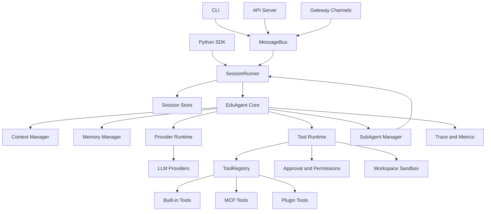

# EduAgent 核心 Agent 功能补齐计划

## 1. 调研目标

本计划基于当前项目的 `docs/current.md`，并参考以下公开资料：

- Nanobot GitHub：<https://github.com/HKUDS/nanobot>
- Nanobot DeepWiki：<https://deepwiki.com/HKUDS/nanobot>
- Hermes Agent 架构文档：<https://hermes-agent.nousresearch.com/docs/developer-guide/architecture>
- Hermes Agent 工具文档：<https://hermes-agent.nousresearch.com/docs/developer-guide/adding-tools>
- Hermes Agent 子 Agent 文档：<https://hermes-agent.nousresearch.com/docs/user-guide/features/delegation>
- Hermes Agent Skills 文档：<https://hermes-agent.nousresearch.com/docs/user-guide/features/skills>
- Hermes Agent DeepWiki：<https://deepwiki.com/NousResearch/hermes-agent>

目标是分析：如果要把当前 EduAgent 从“教学场景同步 CLI Agent”升级为“核心功能完整的 Agent 框架”，除了现有模块外，还需要补齐哪些模块，并给出分阶段实现路线。

## 2. 当前项目已有能力

根据 `docs/current.md`，当前项目已有以下核心模块：

- `edu_agent.agent`：同步 ReAct 主循环。
- `edu_agent.cli`：交互式 CLI。
- `edu_agent.registry`：工具注册与分发。
- `edu_agent.tools`：内置工具集合。
- `edu_agent.prompt_builder`：system prompt 组装。
- `edu_agent.skills_loader`：Markdown 技能加载。
- `edu_agent.skill_tool_registry`：脚本型技能注册为工具。
- `edu_agent.subagent`：隔离子 Agent 委派。
- `edu_agent.session_store`：JSONL 会话持久化。
- `edu_agent.learner_profile`：学习者画像。
- `edu_agent.safety`：规则型输入/输出安全检查。
- `edu_agent.cron`：本地定时任务。
- `rag_mvp`：RAG、文档解析、题目生成、思维导图底层能力。

当前架构已经覆盖了 Agent 的最小闭环：Prompt -> LLM -> Tool Call -> Tool Result -> Final Answer。

## 3. 参考项目关键启发

### 3.1 Nanobot

Nanobot 的核心特点是“小核心 + 多入口 + 长期运行能力”：

- 以一个可读的 Agent loop 为中心。
- 使用消息总线解耦 Telegram、Discord、Slack、WebSocket 等 channel 与 Agent。
- 支持每个 session 串行、跨 session 并发。
- 支持多 provider、MCP、memory、skills、cron、WebUI、OpenAI-compatible API、Python SDK。
- 有 workspace 概念，包含 `MEMORY.md`、`HISTORY.md`、`sessions/`、`skills/` 等文件。
- 有 Dream 类长期记忆压缩机制，把长会话沉淀为长期事实。

对 EduAgent 的启发：

- 不应把所有入口都直接耦合到 `EduAgent`，需要消息总线和 session runner。
- 当前 JSONL 会话存储偏轻，需要 session 生命周期、索引、恢复和搜索能力。
- 当前学习者画像是静态摘要，需要自动记忆沉淀和画像更新闭环。
- 当前只有 CLI 入口，缺少 SDK、API、WebSocket 或消息平台网关。

### 3.2 Hermes Agent

Hermes Agent 的核心特点是“平台无关核心 + 完整工具运行时 + 可扩展系统”：

- 入口包括 CLI、Gateway、ACP、Batch Runner、API Server、Python Library。
- 核心 `AIAgent` 统一协调 prompt builder、provider resolution、tool dispatch、compression、persistence。
- 工具注册使用 registry 模式，工具按 toolset 管理，并支持 availability check。
- provider runtime resolution 负责模型、API mode、API key、base URL、OAuth、fallback。
- session storage 使用 SQLite + FTS5，支持搜索和 lineage。
- 有插件系统、MCP 动态工具、环境抽象、沙箱、terminal backend、进程管理。
- 子 Agent 支持批量并行、超时、可观测、取消传播、工具集限制和最终摘要回传。

对 EduAgent 的启发：

- 当前 `ToolRegistry` 方向正确，但缺少 toolset 管理、权限、可用性检查和动态工具来源。
- 当前 LLM 配置直接来自 `rag_mvp.config.settings`，需要独立 provider 层。
- 当前上下文会无限进入 `self.messages`，缺少 token 预算、压缩和 prompt caching。
- 当前子 Agent 只有单任务同步版本，缺少批量并行、超时、状态追踪和取消机制。
- 当前没有可插拔插件、MCP 客户端、执行环境和审批机制。

## 4. 模块差距分析

### 4.1 配置与运行时环境模块

当前问题：

- `AgentConfig` 只覆盖单次运行参数。
- LLM 配置复用 `rag_mvp.config.settings`，与 EduAgent 自身运行时耦合不清。
- 没有用户级 home 目录、profile 隔离、配置迁移、初始化向导。

建议新增模块：

- `edu_agent.config`
  - 定义 `EduSettings`、`ProviderConfig`、`AgentRuntimeConfig`、`ToolConfig`、`GatewayConfig`。
  - 从 `edu_agent.yaml`、`.env`、环境变量加载配置。
  - 支持默认值、校验、迁移。

- `edu_agent.paths`
  - 统一管理 `EDU_HOME`、workspace、session、memory、skills、logs、cache 路径。

- `edu_agent.setup`
  - 初始化向导：选择 provider、模型、skills 目录、RAG 路径。

### 4.2 Provider 运行时模块

当前问题：

- 当前只直接创建 OpenAI compatible client。
- 不支持多 provider 注册、模型元数据、上下文窗口、fallback、重试、速率限制处理。

建议新增模块：

- `edu_agent.providers.registry`
  - provider 元数据注册表。
  - 记录 provider 名称、base_url、api_mode、鉴权方式、默认模型。

- `edu_agent.providers.runtime`
  - 根据 `AgentConfig` 和全局配置解析最终 provider、model、api_key、base_url。
  - 统一创建 LLM client。

- `edu_agent.providers.model_metadata`
  - 记录模型上下文长度、是否支持 tool calling、是否支持 streaming、成本估算。

- `edu_agent.providers.retry`
  - API 重试、fallback、限流退避、错误归一化。

### 4.3 上下文管理与压缩模块

当前问题：

- `EduAgent.messages` 随会话增长。
- 没有 token 预算、历史裁剪、摘要压缩。
- system prompt 每轮重建，但没有缓存策略。

建议新增模块：

- `edu_agent.context.manager`
  - 根据模型上下文窗口组装最终 messages。
  - 决定保留哪些原始消息、哪些进入摘要。

- `edu_agent.context.compressor`
  - 使用辅助 LLM 将中间历史压缩为摘要。
  - 保留工具结果、用户偏好、未完成任务、重要事实。

- `edu_agent.context.token_counter`
  - 粗略 token 估算，避免超上下文。

- `edu_agent.context.prompt_cache`
  - 对稳定 prompt 前缀做缓存标记或本地缓存。

### 4.4 长期记忆与学习闭环模块

当前问题：

- `learner_profile` 只提供读写和摘要。
- 缺少从会话中自动提取事实、偏好、知识掌握度的机制。
- 没有记忆冲突处理、记忆检索和记忆提供者接口。

建议新增模块：

- `edu_agent.memory.manager`
  - 统一读写长期记忆、学习者画像、会话摘要。

- `edu_agent.memory.consolidator`
  - 类似 Nanobot Dream，把会话定期压缩成长期事实。
  - 输出学习进度、偏好、薄弱知识点、已完成目标。

- `edu_agent.memory.provider`
  - 抽象记忆后端，初期本地 JSON/Markdown，后续可接 SQLite、向量库、Honcho 类服务。

- `edu_agent.tools.memory`
  - 提供 `remember_fact`、`search_memory`、`update_profile` 等工具。

### 4.5 会话存储与检索模块

当前问题：

- 只有 append-only JSONL。
- 没有 session index、搜索、恢复、压缩 lineage。
- CLI `reset()` 只清空内存，不处理持久会话生命周期。

建议新增模块：

- `edu_agent.sessions.db`
  - SQLite 会话库。
  - 表：sessions、messages、tool_calls、summaries、artifacts。

- `edu_agent.sessions.search`
  - FTS5 全文搜索或轻量关键词搜索。

- `edu_agent.sessions.lifecycle`
  - 创建、恢复、归档、分支、压缩、删除 session。

- `edu_agent.sessions.replay`
  - 从持久会话恢复 OpenAI-compatible messages。

### 4.6 Toolset、权限与工具运行时模块

当前问题：

- 工具已经有 `toolset` 字段，但没有统一 toolset 配置和启停策略。
- `check_fn` 已存在但使用较少。
- 缺少危险工具审批、权限分级、工具结果截断、异步工具桥接。

建议新增模块：

- `edu_agent.toolsets`
  - 定义核心工具集：`rag`、`web`、`files`、`skills`、`memory`、`delegation`、`scheduling`、`mcp`。
  - 支持按 CLI、API、子 Agent、cron 不同场景启用不同工具集。

- `edu_agent.tools.runtime`
  - 统一处理工具调用、JSON 参数校验、结果截断、错误分类、耗时统计。

- `edu_agent.tools.permissions`
  - 工具权限等级：read、write、network、execute、side_effect。
  - 对写文件、网络、调度、未来 shell/code 执行加审批。

- `edu_agent.tools.approval`
  - 用户确认机制。
  - CLI 先实现同步确认，后续扩展到 gateway。

### 4.7 MCP 集成模块

当前问题：

- 当前没有 MCP 客户端。
- 外部工具只能通过内置工具或脚本型技能接入。

建议新增模块：

- `edu_agent.mcp.config`
  - MCP server 配置：stdio、HTTP、SSE。

- `edu_agent.mcp.client`
  - 连接 MCP server，列出 tools/resources/prompts。

- `edu_agent.mcp.tool_adapter`
  - 将 MCP tools 转换为 `ToolRegistry` schema。

- `edu_agent.mcp.resource_adapter`
  - 支持读取 MCP resources，并让 Agent 按需使用。

### 4.8 插件与 Hooks 模块

当前问题：

- 技能系统可以加载 Markdown 和脚本，但没有通用插件生命周期。
- 外部扩展无法注册 hooks、命令、工具集或记忆 provider。

建议新增模块：

- `edu_agent.plugins.manager`
  - 从用户目录、项目目录、Python entry points 发现插件。

- `edu_agent.plugins.api`
  - 插件上下文 API：注册工具、命令、hooks、memory provider、context engine。

- `edu_agent.hooks`
  - 生命周期事件：before_turn、after_turn、before_tool、after_tool、on_error、on_session_start。

### 4.9 消息总线与 Gateway 模块

当前问题：

- CLI 直接调用 `EduAgent.run_turn()`。
- 没有多 channel、多 session 并发、统一入站/出站消息模型。
- 不支持 WebSocket、HTTP API、IM 平台或 WebUI。

建议新增模块：

- `edu_agent.bus`
  - 定义 `InboundMessage`、`OutboundMessage`、`MessageBus`。
  - channel 只投递消息，不直接调用 Agent。

- `edu_agent.runner`
  - 根据 session_id 串行处理同一会话。
  - 跨 session 并发。
  - 负责创建或恢复 `EduAgent`。

- `edu_agent.gateway`
  - 长运行进程，管理 channel adapter、session routing、授权、消息发送。

- `edu_agent.channels`
  - `base.py`：统一 channel 接口。
  - 初期实现 `websocket.py` 或 `http.py`，后续再接 Telegram/Discord/企业微信等。

### 4.10 SDK 与 API Server 模块

当前问题：

- 当前只有 CLI 和 Python 类 `EduAgent`。
- 没有稳定 SDK facade、OpenAI-compatible HTTP API、SSE streaming。

建议新增模块：

- `edu_agent.sdk`
  - 提供 `EduAgentClient` 或 `EduBot` facade。
  - 支持 `from_config()`、`chat()`、`stream()`、`session()`。

- `edu_agent.api.server`
  - HTTP API：`/v1/chat/completions`、`/sessions`、`/tools`。
  - 支持 SSE streaming。

- `edu_agent.api.schemas`
  - 请求/响应 Pydantic schema。

### 4.11 执行环境、沙箱与进程管理模块

当前问题：

- 当前工具以业务工具为主，没有 shell/code execution。
- `files` 工具已限制到 `output/`，但没有统一 workspace sandbox。
- 没有后台进程、超时、取消、中断传播。

建议新增模块：

- `edu_agent.workspace`
  - 统一 workspace 根目录、路径检查、artifact 管理。

- `edu_agent.environments`
  - 抽象执行环境，初期只支持 local，后续可支持 Docker。

- `edu_agent.processes`
  - 后台任务和进程注册表。
  - 支持启动、查看、取消、超时。

- `edu_agent.tools.terminal`
  - 在明确权限和沙箱后提供 shell 执行。

- `edu_agent.tools.code_execution`
  - 受限 Python 代码执行，用于数据处理或教学代码运行。

### 4.12 子 Agent 增强模块

当前问题：

- 当前只支持单个同步子任务。
- 只限制工具白名单和递归。
- 缺少批量并行、超时、进度树、取消传播、角色深度控制。

建议增强：

- `SubAgentConfig`
  - 增加 `context`、`role`、`timeout_seconds`、`model/provider override`。

- `delegate_task`
  - 支持单任务和 `tasks[]` 批量。
  - 支持最大并发数配置。
  - 返回结构化结果列表。

- `edu_agent.subagent_manager`
  - 跟踪运行中子任务。
  - 支持中断、超时、状态查询。

### 4.13 可观测性与诊断模块

当前问题：

- 目前主要依赖 logging 和 CLI spinner。
- 没有统一 trace、token/cost 统计、工具耗时报告、错误诊断文件。

建议新增模块：

- `edu_agent.observability.trace`
  - turn、LLM call、tool call、subagent call 的结构化 trace。

- `edu_agent.observability.metrics`
  - token、耗时、工具成功率、错误类别。

- `edu_agent.observability.diagnostics`
  - 对 provider 失败、tool schema 失败、subagent timeout 输出诊断报告。

## 5. 目标架构草图

## 6. 分阶段实施计划

### Phase 0：架构整理与边界固定

目标：

- 不改变行为，先明确核心边界。
- 为后续拆分 provider、context、tool runtime 做准备。

任务：

- 新增 `edu_agent.paths`，统一默认目录。
- 新增 `edu_agent.config` 的基础配置模型，但暂不替换全部调用。
- 明确 `EduAgent` 只负责 conversation loop，不直接承担 provider、tool runtime、session lifecycle 的全部职责。
- 为现有模块补充 focused tests，锁定当前行为。

验收标准：

- 现有 CLI 和测试不受影响。
- 新配置模块可读取默认值和环境变量。
- 文档中明确模块边界。

### Phase 1：Provider Runtime 与模型元数据

目标：

- 将 LLM 客户端创建从 `EduAgent` 中拆出。
- 支持多 provider 的最低可用抽象。

任务：

- 新增 `edu_agent.providers.registry`。
- 新增 `edu_agent.providers.runtime`。
- 新增 `edu_agent.providers.model_metadata`。
- 改造 `EduAgent.__init__` 使用 runtime resolver 创建 client。
- 保留当前 OpenAI-compatible 默认路径。

验收标准：

- 当前 Qwen / DashScope 配置仍可运行。
- 单元测试可注入 mock provider。
- 后续新增 provider 不需要修改 `EduAgent` 主循环。

### Phase 2：Context Manager 与会话恢复

目标：

- 解决长会话上下文不可控问题。
- 让 session 可以恢复、搜索和压缩。

任务：

- 新增 `edu_agent.context.manager`。
- 新增 token 估算和上下文窗口预算。
- 将 `self.messages` 的 LLM 入参组装交给 context manager。
- 新增 SQLite session store 或在当前 JSONL 上增加 session index。
- 实现 `load_session_as_messages()`。

验收标准：

- 长会话不会无限制传入 LLM。
- CLI 可通过 session_id 恢复历史。
- 工具消息和 assistant tool_calls 能正确 replay。

### Phase 3：Memory Consolidation 与学习闭环

目标：

- 从“手动画像摘要”升级到“自动长期记忆和学习者画像更新”。

任务：

- 新增 `edu_agent.memory.manager`。
- 新增 `edu_agent.memory.consolidator`。
- 实现会话结束或定期触发的记忆提取。
- 增加 `search_memory`、`remember_fact`、`update_profile` 工具。
- 将 `profile_summary()` 的输入扩展为画像 + 长期记忆摘要。

验收标准：

- Agent 能从历史对话中提取学习偏好和薄弱知识点。
- 记忆写入可追踪、可撤销或至少可覆盖。
- Prompt 中的长期记忆不超过预算。

### Phase 4：Tool Runtime、Toolset 与权限审批

目标：

- 把工具从“能调用”升级为“可治理、可配置、可观测”。

任务：

- 新增 `edu_agent.toolsets`。
- 新增 `edu_agent.tools.runtime`。
- 对所有工具接入统一参数校验、耗时统计、结果截断。
- 强化 `check_fn` 和 requires_env。
- 新增 `edu_agent.tools.permissions` 和 `edu_agent.tools.approval`。
- 按场景定义工具集：CLI、subagent、cron、api。

验收标准：

- 可以按配置启用/禁用工具集。
- 写文件、调度、未来 shell/code 执行等副作用工具可被审批。
- 工具错误格式一致。

### Phase 5：MCP 与插件系统

目标：

- 让外部能力不必改核心代码即可接入。

任务：

- 新增 `edu_agent.mcp.client`。
- 支持从配置加载 MCP server。
- 将 MCP tools 映射到 `ToolRegistry`。
- 新增 `edu_agent.plugins.manager` 和插件 API。
- 插件可注册工具、hooks、memory provider、context engine。

验收标准：

- 至少支持一个 stdio MCP server。
- 插件可以在不修改 `edu_agent.tools` 的情况下注册工具。
- MCP 工具 schema 能被 LLM 正常看到并调用。

### Phase 6：消息总线、SessionRunner 与 API

目标：

- 从单 CLI 调用升级为多入口可复用运行时。

任务：

- 新增 `edu_agent.bus`。
- 新增 `edu_agent.runner`，负责 per-session lock。
- 改造 CLI 走 runner，而不是直接持有单个 `EduAgent`。
- 新增 `edu_agent.api.server`，提供 OpenAI-compatible chat endpoint。
- 支持 SSE streaming。

验收标准：

- 同一 session 串行执行，多个 session 可并发。
- CLI 行为保持可用。
- HTTP API 可以完成一轮工具调用对话。

### Phase 7：Gateway 与 Channel Adapter

目标：

- 支持长期运行、多 channel 接入。

任务：

- 新增 `edu_agent.gateway`。
- 新增 `edu_agent.channels.base`。
- 初期实现 WebSocket channel 或 HTTP webhook channel。
- 增加基本授权、session routing、outbound delivery。
- 后续再接具体 IM 平台。

验收标准：

- 可以通过 WebSocket 或 webhook 与 Agent 对话。
- channel 不直接调用 `EduAgent`，只通过 message bus。
- gateway 可长期运行并处理多个 session。

### Phase 8：执行环境、沙箱与后台进程

目标：

- 为代码执行、终端工具、长任务提供安全运行基础。

任务：

- 新增 `edu_agent.workspace`。
- 新增 `edu_agent.environments`，先实现 local backend。
- 新增 `edu_agent.processes`。
- 增加路径沙箱、超时、取消、中断传播。
- 在权限审批到位后新增 terminal/code execution 工具。

验收标准：

- 所有文件操作经过 workspace 路径校验。
- 长任务可查询、取消、超时终止。
- shell/code execution 默认关闭，必须显式启用。

### Phase 9：子 Agent 增强与可观测性

目标：

- 把子 Agent 从基础委派升级为可监控、可取消、可批量的协作机制。

任务：

- 扩展 `delegate_task` 支持 `tasks[]`。
- 新增 `SubAgentManager`。
- 增加子任务超时、取消、并发配置。
- 增加运行状态查询。
- 新增 `edu_agent.observability.trace` 和 metrics。

验收标准：

- 可以并行执行多个研究/处理子任务。
- 父任务中断时子任务能被取消。
- 每轮对话可看到 LLM/tool/subagent 的结构化 trace。

## 7. 推荐优先级

第一优先级：

- `config`
- `providers`
- `context`
- `sessions`
- `toolsets/tools.runtime`

原因：这些模块直接影响核心 Agent 稳定性，是后续 gateway、MCP、插件、沙箱的基础。

第二优先级：

- `memory`
- `mcp`
- `plugins`
- `api`
- `runner`

原因：这些模块让 Agent 从“单机教学助手”扩展为“可集成、可长期运行、可扩展”的框架。

第三优先级：

- `gateway`
- `channels`
- `workspace/environments/processes`
- `subagent_manager`
- `observability`

原因：这些模块增加生产可用性和复杂场景能力，但依赖前两批基础设施。

## 8. 最小核心完整版本定义

如果目标是先实现“核心功能完整，但不过度膨胀”的 Agent，建议 MVP 包含：

- 多 provider runtime。
- 上下文预算与压缩。
- 可恢复 session store。
- 长期记忆 consolidation。
- toolset 和权限控制。
- MCP 工具接入。
- Python SDK。
- OpenAI-compatible API。
- SessionRunner，支持同 session 串行、跨 session 并发。

暂缓：

- 多 IM 平台 gateway。
- Docker/SSH/Cloud execution backend。
- ACP/IDE 集成。
- RL trajectory / batch training。
- 完整 WebUI。

## 9. 实施原则

- 先拆边界，再加能力。
- 保持 `EduAgent.run_turn()` 的主流程可读。
- 新模块必须能被测试替换，避免直接依赖真实 LLM。
- 所有副作用能力默认关闭或需要审批。
- 长会话必须先过 context manager，再进入 LLM。
- 技能、工具、MCP、插件都应汇聚到统一 registry，不形成多套调用路径。
- CLI、API、Gateway、SDK 都应复用同一个 SessionRunner，不各自实现 Agent 生命周期。
