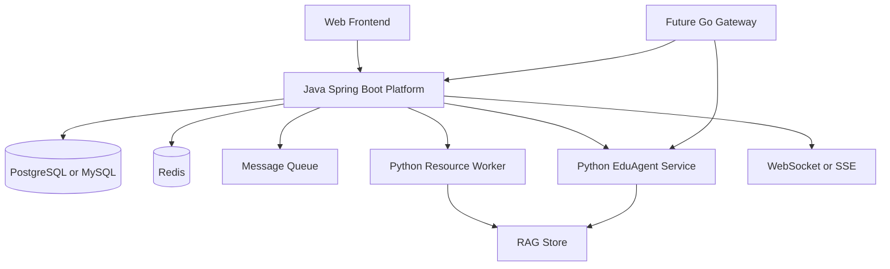
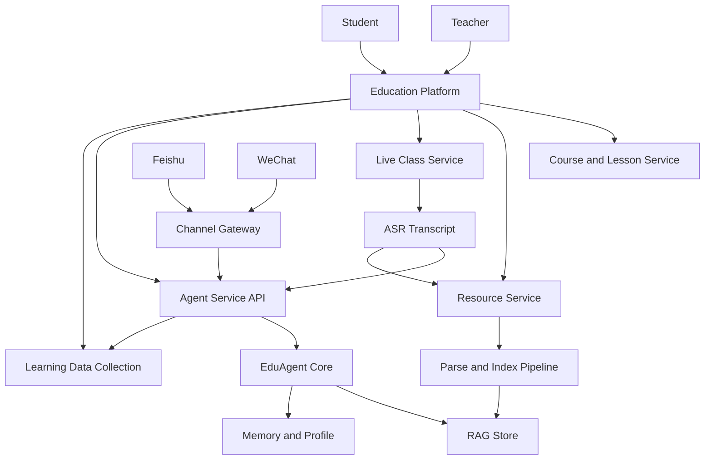
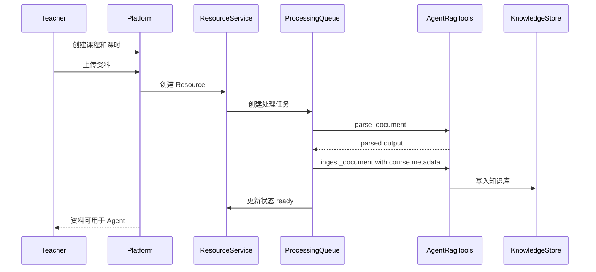
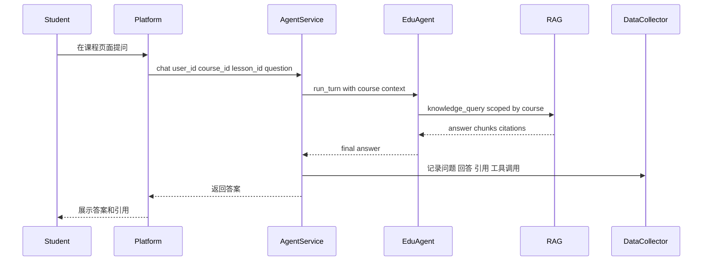
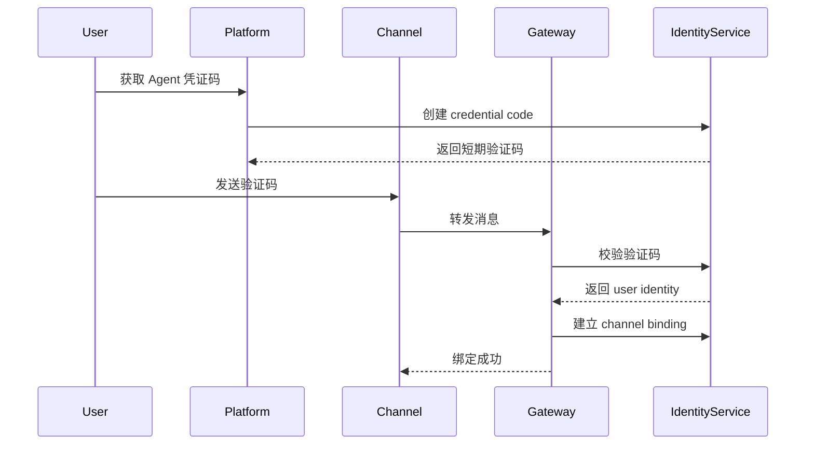
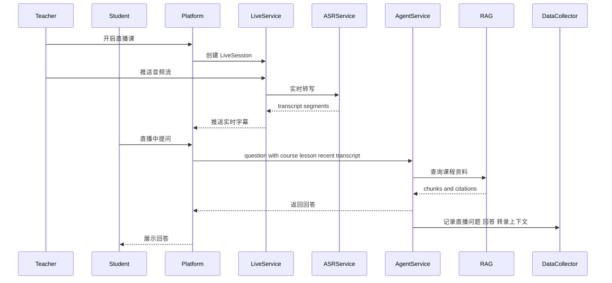

# EduAgent 教育平台 PRD

## 1. 背景与目标

当前项目已经具备一个可工作的教学 Agent 核心：支持 ReAct 对话循环、工具调用、RAG 查询、资料解析、技能系统、子 Agent、会话记录和学习者画像。后续目标是在此基础上建设一个教育平台，让教师可以管理课程、课时和教学资料，让学生围绕课程内容与自己的 Agent 进行学习问答，并逐步接入微信、飞书等国内常见平台。

本 PRD 的产品方向是：

- 当前 Agent 仍是核心能力。
- 教育平台作为 Agent 的管理、内容、身份、数据和业务扩展。
- 第一版 MVP 优先覆盖“课程 -> 课时 -> 资料上传/处理 -> RAG -> 学生课程问答”主链路。

## 2. 产品定位

EduAgent 教育平台是一个“课程内容驱动的 AI 教学平台”。

它不是单纯的 LMS，也不是单纯的聊天机器人，而是围绕课程知识库、学习过程数据和多渠道 Agent 交互构建的教学辅助系统。

核心价值：

- 教师可以把课程资料结构化沉淀为 Agent 可使用的知识库。
- 学生可以获得绑定自己身份的 Agent，在平台或外部渠道中持续学习。
- 平台可以收集学生问题、学习路径、薄弱点，为教师提供教学反馈。
- Agent 可以基于课程、课时、资料、作业和学生画像进行个性化回答。

## 3. 目标用户

### 3.1 教师

教师负责创建课程、课时、上传教学资料、查看学生学习情况。

典型需求：

- 创建课程和课时。
- 上传 PDF、PPT、Word、Markdown、图片等资料。
- 查看资料处理状态。
- 设置课程可见范围。
- 查看学生围绕课程提出的问题。
- 查看班级或课程维度的数据分析。
- 后续发布作业、查看提交、使用 Agent 辅助批改。

### 3.2 学生

学生围绕课程内容学习，并通过 Agent 提问。

典型需求：

- 加入课程。
- 查看课时和资料。
- 获取自己的 Agent 凭证码。
- 在平台内或微信/飞书中绑定自己的 Agent。
- 向 Agent 提问课程相关问题。
- 获得基于课程资料的答案、提示、练习题和反馈。
- 后续完成作业并获得个性化辅导。

### 3.3 管理员

管理员负责平台配置、用户管理、渠道接入和系统监控。

典型需求：

- 管理教师、学生、课程空间。
- 配置 Agent 服务、RAG 存储、模型 provider。
- 配置微信、飞书等渠道。
- 查看系统运行状态和异常。

## 4. MVP 范围

第一版 MVP 聚焦以下能力：

- 用户身份：教师、学生、管理员。
- 课程管理：教师创建课程。
- 课时管理：教师在课程下创建课时。
- 资料上传：教师上传资料到课程或课时。
- 资料处理：平台调用当前文档解析和 RAG ingest 能力。
- RAG 绑定：资料处理后进入课程级或课时级知识库。
- Agent 绑定：学生和教师可以获取唯一凭证码，绑定自己的 Agent 身份。
- 平台内问答：学生在课程页面向 Agent 提问，Agent 优先使用课程资料回答。
- 数据采集：记录问题、课程上下文、回答、命中的资料、学生身份和时间。

MVP 暂不优先实现：

- 完整作业系统。
- 自动批改闭环。
- 微信/飞书正式生产接入。
- 复杂 BI 看板。
- 多学校/多租户商业化权限体系。
- 移动端 App。
- 直播课实时转录与实时提问。

## 4.1 技术架构选型

后端建议采用分层服务架构：

- Java / Spring Boot 作为教育平台主后端。
- Python 保留并服务化当前 EduAgent、RAG、资料解析和 AI 能力。
- Go 暂不作为第一阶段主后端，后续可用于高并发实时网关类服务。

选型理由：

- 教育平台主业务包含课程、课时、资料、作业、权限、用户、数据统计、后台管理和第三方集成，属于典型复杂业务系统，Java / Spring Boot 在工程规范、事务、权限、安全、生态和团队扩展上更稳。
- 当前 Agent/RAG 已经是 Python 实现，继续以 Python 服务承载 AI 能力可以减少迁移成本。
- 微信、飞书、直播 WebSocket、实时音频流转发等高并发网关能力，后续如压力明确，可以拆为 Go 服务。

推荐初期架构：

初期边界：

- Java 负责平台业务 API、权限、课程、课时、资料、作业、统计、用户身份和渠道绑定。
- Python 负责 Agent 对话、RAG 检索、资料解析、题目生成、思维导图等 AI 能力。
- Java 通过 HTTP/gRPC 或内部 REST 调用 Python Agent Service。
- 资料处理通过 Java 创建任务，Python Worker 消费任务并回写状态。

## 5. 产品模块

### 5.1 身份与账号模块

功能：

- 用户注册/登录。
- 用户角色：teacher、student、admin。
- 用户基础资料。
- 学生与教师都可以生成 Agent 凭证码。
- 凭证码用于外部渠道绑定身份。

凭证码要求：

- 一次性或短期有效。
- 与用户 ID、角色、有效期、绑定状态关联。
- 支持撤销和重新生成。
- 绑定成功后生成 channel identity mapping。

核心实体：

- `User`
- `Role`
- `AgentCredentialCode`
- `AgentIdentityBinding`

### 5.2 课程模块

功能：

- 教师创建课程。
- 编辑课程名称、简介、封面、可见状态。
- 学生加入课程。
- 教师查看课程学生列表。

核心实体：

- `Course`
- `CourseMember`

课程权限：

- 教师可以管理自己的课程。
- 学生只能访问已加入课程。
- 管理员可查看全部课程。

### 5.3 课时模块

功能：

- 教师在课程下创建课时。
- 每个课时可以绑定多个资料。
- 学生可以查看课程下的课时列表。
- Agent 回答时可以限定在某个课时上下文内。

核心实体：

- `Lesson`

### 5.4 资料模块

功能：

- 教师上传资料。
- 资料可绑定到课程或课时。
- 支持查看处理状态。
- 支持重新处理。
- 支持删除或停用资料。

资料类型：

- PDF
- PPT/PPTX
- Word
- Markdown
- TXT
- 图片

处理状态：

- `uploaded`
- `parsing`
- `parsed`
- `indexing`
- `ready`
- `failed`

核心实体：

- `Resource`
- `ResourceProcessingJob`
- `ResourceChunk`

### 5.5 RAG 知识库模块

功能：

- 按课程或课时组织资料索引。
- 资料处理后写入对应知识库。
- Agent 回答时根据课程/课时上下文选择 RAG 查询范围。
- 保留资料来源引用，支持回答溯源。

MVP 建议：

- 优先实现课程级知识库。
- 课时级作为 metadata filter，而不是一开始就维护完全独立索引。
- 每个 chunk 记录 `course_id`、`lesson_id`、`resource_id`、`page`、`section` 等元数据。

核心实体：

- `KnowledgeCollection`
- `KnowledgeDocument`
- `KnowledgeChunk`

### 5.6 Agent 交互模块

功能：

- 学生在课程页面向 Agent 提问。
- 请求必须携带 user、course、可选 lesson 上下文。
- Agent system prompt 中注入课程信息、课时信息、学生画像。
- Agent 工具调用 `knowledge_query` 时自动限定课程资料范围。
- 保存每轮问答记录。

回答要求：

- 优先基于课程资料回答。
- 如果资料不足，明确说明“不在当前课程资料中”。
- 可给出学习建议。
- 可推荐相关课时。
- 后续可生成练习题、提示和作业反馈。

核心实体：

- `AgentSession`
- `AgentMessage`
- `QuestionRecord`
- `RagCitation`

### 5.7 数据采集模块

MVP 需要先采集原始数据，不急于做复杂分析。

采集内容：

- 学生问题。
- 所属课程和课时。
- Agent 回答。
- 是否调用 RAG。
- 命中的资料和 chunk。
- 工具调用耗时。
- 用户反馈，如有用/无用。
- 时间、渠道、session。

用途：

- 后续教师看板。
- 学生薄弱点分析。
- 课程资料缺口分析。
- Agent 效果评估。

核心实体：

- `LearningEvent`
- `QuestionAnalyticsRecord`

### 5.8 直播课实时转录与实时提问模块

该模块作为 Phase 3 重点能力，不放入第一版课程 RAG MVP，但需要在架构上提前预留。

功能目标：

- 教师开启直播课。
- 系统实时采集教师音频并转写为文本。
- 学生可以在直播过程中实时提问。
- Agent 回答时同时参考课程资料、当前课时资料和最近直播转录内容。
- 直播结束后，转录内容可以沉淀为课时资料，并进入 RAG。

MVP 后的建议实现：

- 先不自研完整直播推流系统。
- 先实现平台内“直播课堂页面 + 浏览器麦克风采集 + 实时 ASR + 学生提问”。
- ASR 优先接国内云服务或成熟本地方案，如阿里云、腾讯云、讯飞、FunASR。
- 学生提问通过平台 WebSocket/SSE 进入 Agent Service。
- Agent 使用最近几分钟 transcript segments 作为临时上下文。
- 直播结束后将完整 transcript 作为 `Resource` 写入资料处理流程。

核心实体：

- `LiveSession`
- `LiveParticipant`
- `TranscriptSegment`
- `LiveQuestion`
- `LiveAgentAnswer`

实时问答上下文：

- `course_id`
- `lesson_id`
- 最近直播转录片段
- 当前课程 RAG 资料
- 学生历史问题和画像

推荐约束：

- Agent 回答应标记答案来源：课程资料、直播上下文、模型常识。
- 当直播转录不稳定时，需要允许学生追问或教师修正。
- 直播实时问答不应打断教师主讲，默认以侧边栏形式展示。

## 6. 后续模块规划

### 6.1 作业模块

后续功能：

- 教师创建作业。
- 作业绑定课程或课时。
- 学生提交文本、文件或代码。
- Agent 提供提示，不直接替学生完成。
- Agent 辅助教师生成评分建议。
- 教师最终确认成绩和反馈。

核心实体：

- `Assignment`
- `AssignmentSubmission`
- `AssignmentFeedback`
- `Rubric`

### 6.2 教师分析看板

后续功能：

- 高频问题统计。
- 课程资料覆盖不足的问题。
- 学生薄弱知识点。
- 学生活跃度。
- 课时维度学习热度。
- Agent 无法回答的问题列表。

### 6.3 微信/飞书接入

后续功能：

- 学生或教师在平台获取凭证码。
- 在微信/飞书发送凭证码完成绑定。
- 外部渠道消息进入 Agent gateway。
- Agent 根据绑定身份识别用户。
- 支持选择课程上下文。

MVP 后的推荐顺序：

1. 先实现平台内 Agent 对话。
2. 再实现 WebSocket 或 HTTP webhook gateway。
3. 再接飞书。
4. 最后接微信生态。

原因：

- 飞书开放能力和机器人开发体验通常更适合先做企业/教学场景验证。
- 微信生态接入方式更多样，可能涉及公众号、企微、个人微信不同路线，需要后续单独确认。

### 6.4 多渠道 Agent 统一身份

需要支持：

- 同一个用户在平台、飞书、微信中对应同一个 Agent identity。
- 不同渠道的 session 可以独立，也可以合并到同一长期画像。
- 教师和学生的 Agent 权限不同。

核心实体：

- `Channel`
- `ChannelAccount`
- `AgentIdentityBinding`
- `ExternalSession`

### 6.5 直播课能力

后续功能：

- 教师创建直播课。
- 学生进入直播间。
- 实时转录教师语音。
- 学生在直播过程中向 Agent 提问。
- Agent 基于课程 RAG 和实时转录回答。
- 直播结束后自动生成文字稿、摘要和知识点。
- 转录稿可一键沉淀为课时资料。

直播课与 Agent 的关系：

- 直播转录提供短期上下文。
- 课程资料提供稳定知识来源。
- 学生提问进入学习数据采集。
- 课后转录稿进入长期 RAG。

## 7. Agent 与平台的关系

产品选型：

- 当前 Agent 是核心。
- 平台是围绕 Agent 的内容管理、身份绑定、数据采集和教学业务层。

建议系统关系：

## 8. 关键业务流程

### 8.1 教师创建课程并上传资料

### 8.2 学生在课程中向 Agent 提问

### 8.3 用户通过凭证码绑定外部渠道

### 8.4 直播课实时转录与提问

## 9. MVP 详细需求

### 9.1 教师端

必须支持：

- 创建课程。
- 创建课时。
- 上传资料。
- 查看资料处理状态。
- 删除资料或标记不可用。
- 进入课程测试 Agent 问答。

可延后：

- 课程封面。
- 批量导入学生。
- 复杂班级管理。
- 复杂权限审批。

### 9.2 学生端

必须支持：

- 查看已加入课程。
- 查看课程课时。
- 在课程内向 Agent 提问。
- 查看 Agent 回答和资料引用。
- 获取自己的 Agent 凭证码。

可延后：

- 学习进度条。
- 收藏问答。
- 笔记系统。
- 移动端专门适配。

### 9.3 Agent 服务端

必须支持：

- 接收 `user_id`、`course_id`、`lesson_id`、`message`。
- 构造课程上下文 prompt。
- 限定 RAG 检索范围。
- 返回答案、引用、工具调用元数据。
- 记录学习事件。

需要改造当前 Agent 的点：

- `knowledge_query` 需要支持 metadata filter。
- `AgentConfig` 需要支持业务上下文，如 course、lesson、role。
- `session_store` 需要能记录平台 session 与课程上下文。
- `learner_profile` 后续需要按课程维度扩展。

### 9.4 资料处理服务

必须支持：

- 上传文件落盘或对象存储。
- 创建异步处理任务。
- 调用现有 `parse_document` 能力。
- 调用现有 `ingest_document` 能力。
- 写入课程/课时元数据。
- 失败可重试。

MVP 可以先使用本地文件和本地任务队列，后续再接对象存储、Celery/RQ、独立 worker。

## 10. 建议数据模型

### 10.1 用户与身份

- `users`
  - `id`
  - `name`
  - `email`
  - `phone`
  - `role`
  - `created_at`

- `agent_credential_codes`
  - `id`
  - `code`
  - `user_id`
  - `expires_at`
  - `used_at`
  - `revoked_at`

- `agent_identity_bindings`
  - `id`
  - `user_id`
  - `channel`
  - `external_user_id`
  - `created_at`

### 10.2 课程与课时

- `courses`
  - `id`
  - `teacher_id`
  - `title`
  - `description`
  - `status`
  - `created_at`

- `course_members`
  - `id`
  - `course_id`
  - `user_id`
  - `role`
  - `joined_at`

- `lessons`
  - `id`
  - `course_id`
  - `title`
  - `description`
  - `sort_order`
  - `created_at`

### 10.3 资料与知识库

- `resources`
  - `id`
  - `course_id`
  - `lesson_id`
  - `uploaded_by`
  - `filename`
  - `file_type`
  - `storage_path`
  - `status`
  - `error_message`
  - `created_at`

- `resource_processing_jobs`
  - `id`
  - `resource_id`
  - `status`
  - `started_at`
  - `finished_at`
  - `error_message`

- `knowledge_chunks`
  - `id`
  - `course_id`
  - `lesson_id`
  - `resource_id`
  - `chunk_ref`
  - `text_preview`
  - `metadata`

### 10.4 Agent 与数据采集

- `agent_sessions`
  - `id`
  - `user_id`
  - `course_id`
  - `lesson_id`
  - `channel`
  - `created_at`

- `agent_messages`
  - `id`
  - `session_id`
  - `role`
  - `content`
  - `metadata`
  - `created_at`

- `learning_events`
  - `id`
  - `user_id`
  - `course_id`
  - `lesson_id`
  - `event_type`
  - `payload`
  - `created_at`

- `question_records`
  - `id`
  - `user_id`
  - `course_id`
  - `lesson_id`
  - `question`
  - `answer`
  - `citations`
  - `feedback`
  - `created_at`

### 10.5 直播课

- `live_sessions`
  - `id`
  - `course_id`
  - `lesson_id`
  - `teacher_id`
  - `title`
  - `status`
  - `started_at`
  - `ended_at`
  - `transcript_resource_id`

- `live_participants`
  - `id`
  - `live_session_id`
  - `user_id`
  - `role`
  - `joined_at`
  - `left_at`

- `transcript_segments`
  - `id`
  - `live_session_id`
  - `speaker_id`
  - `start_time_ms`
  - `end_time_ms`
  - `text`
  - `confidence`
  - `created_at`

- `live_questions`
  - `id`
  - `live_session_id`
  - `user_id`
  - `course_id`
  - `lesson_id`
  - `question`
  - `answer`
  - `transcript_window`
  - `citations`
  - `created_at`

## 11. Agent 核心改造点

### 11.1 课程上下文

新增业务上下文对象：

- `AgentBusinessContext`
  - `user_id`
  - `role`
  - `course_id`
  - `course_title`
  - `lesson_id`
  - `lesson_title`
  - `channel`

用途：

- 注入 prompt。
- 限制工具权限。
- 限制 RAG 范围。
- 记录学习数据。

### 11.2 RAG metadata filter

当前 `knowledge_query(question, mode)` 需要扩展为：

- `question`
- `mode`
- `course_id`
- `lesson_id`
- `resource_ids`
- `with_citations`

目标：

- 同一个底层 RAG store 可以服务多个课程。
- Agent 不会把其他课程资料混入回答。

### 11.3 平台 Agent API

建议新增内部 API：

- `POST /agent/chat`
  - 输入：`user_id`、`course_id`、`lesson_id`、`message`、`session_id`
  - 输出：`answer`、`session_id`、`citations`、`tool_calls`

- `POST /agent/credentials`
  - 创建绑定凭证码。

- `POST /agent/channel-bindings/verify`
  - 外部渠道校验凭证码。

### 11.4 数据采集 Hook

在 Agent 执行后触发：

- `on_question_asked`
- `on_rag_retrieved`
- `on_answer_generated`
- `on_feedback_received`

初期可以直接写数据库，后续抽象为 event bus。

### 11.5 直播上下文

直播问答需要在课程上下文之外额外注入实时上下文：

- `live_session_id`
- 最近 N 分钟转录文本
- 当前讲解主题，如可识别
- 学生提问发生时的转录时间点

Agent 回答策略：

- 优先使用课程 RAG 和课时资料。
- 当问题明显指向“老师刚才说的内容”时，结合最近转录片段。
- 如果转录内容不完整或置信度低，需要提示“根据当前转录可能是...”。
- 直播结束后，完整 transcript 应作为资料重新进入 RAG，而不是长期依赖临时上下文。

## 12. 非功能需求

### 12.1 安全

- 学生只能访问自己加入课程的资料。
- 教师只能管理自己的课程。
- RAG 查询必须带权限过滤。
- 凭证码短期有效。
- 外部渠道绑定后可解绑。
- 资料上传需要限制文件类型和大小。

### 12.2 性能

- 资料处理异步化。
- 问答接口首 token 响应尽量支持 streaming。
- 常见课程上下文可缓存。
- RAG 查询需要记录耗时。
- 直播实时字幕需要低延迟推送，目标端到端延迟控制在 2 到 5 秒内。
- 直播问答需要限制单个学生的提问频率，避免高峰时压垮 Agent 服务。

### 12.3 可观测性

- 记录资料处理日志。
- 记录 Agent 工具调用日志。
- 记录 RAG 命中情况。
- 记录失败问题，用于教师补充资料。

### 12.4 可扩展性

- 后续支持多学校、多班级。
- 后续支持多个外部渠道。
- 后续支持不同课程使用不同 Agent 策略或技能。
- 后续支持作业、考试、错题本、学习路径。
- 后续支持把直播转录、课后摘要、课堂高频问题沉淀为课程资料。

## 13. 分阶段路线

### Phase 1：课程 RAG MVP

目标：

- 教师能创建课程/课时并上传资料。
- 资料处理后能用于课程 Agent 问答。
- 学生能在平台内围绕课程提问。

核心功能：

- 用户角色。
- 课程/课时 CRUD。
- 资料上传和处理任务。
- RAG metadata 绑定。
- 平台内 Agent chat API。
- 问题和回答采集。

### Phase 2：Agent 身份绑定与会话体系

目标：

- 学生和教师拥有自己的 Agent identity。
- 支持凭证码绑定。
- 支持跨平台会话基础模型。

核心功能：

- 凭证码生成、校验、撤销。
- Agent identity binding。
- Agent session 与课程上下文绑定。
- 学生画像按课程维度记录。

### Phase 3：直播课实时转录与实时提问

目标：

- 教师可以开启直播课。
- 平台可以实时转录教师语音。
- 学生可以在直播中向 Agent 提问。
- 直播结束后转录稿可以沉淀为课程资料。

核心功能：

- LiveSession。
- 浏览器麦克风音频采集。
- ASR 服务接入。
- 实时字幕推送。
- 直播问答 API。
- 最近转录片段注入 Agent 上下文。
- 直播转录稿入库并进入资料处理流程。

### Phase 4：飞书/微信 Gateway

目标：

- 外部平台可以接入 Agent。
- 用户通过凭证码绑定后，在外部渠道提问。

核心功能：

- Gateway service。
- Channel adapter base。
- 飞书机器人接入。
- 微信接入方案调研和 PoC。
- 外部消息 session routing。

### Phase 5：作业与反馈

目标：

- 教师可以发布作业。
- 学生提交作业。
- Agent 辅助反馈和批改建议。

核心功能：

- 作业 CRUD。
- 提交记录。
- Rubric。
- Agent 生成反馈。
- 教师确认成绩。

### Phase 6：数据分析与教学看板

目标：

- 教师可以看到学生问题和课程薄弱点。
- 平台能辅助教师优化教学资料。

核心功能：

- 高频问题。
- 未命中资料的问题。
- 学生薄弱知识点。
- 课程/课时热度。
- Agent 回答质量反馈。

## 14. 当前需要继续讨论的问题

以下问题会影响详细设计，但不阻塞 MVP 概念成立：

- 平台前端技术栈选择。
- Java 主后端选择 Spring Boot 单体优先，还是从一开始拆分微服务。
- 数据库使用 PostgreSQL、SQLite 还是先本地文件。
- RAG 是否为每个课程独立索引，还是统一索引加 metadata filter。
- 微信接入选择公众号、企业微信、微信客服还是其他方式。
- 飞书接入是自建应用机器人还是群机器人。
- 课程成员是教师手动邀请、邀请码加入，还是导入名单。
- 资料是否需要对象存储。
- 是否要支持多学校/多租户。
- 直播 ASR 优先接云服务，还是优先自部署 FunASR。
- 直播课堂是否需要接入第三方直播云，还是先做浏览器音频采集和实时字幕。

## 15. MVP 成功标准

MVP 可以认为成功，当满足以下条件：

- 教师能创建一门课程并上传至少一种资料。
- 资料处理完成后，学生能围绕该资料向 Agent 提问。
- Agent 回答能限定在当前课程资料范围内，并返回引用来源。
- 平台能记录学生问题、Agent 回答、资料命中情况。
- 学生和教师都能生成 Agent 凭证码。
- 系统设计能自然扩展到飞书/微信渠道接入。
- 系统设计能自然扩展到直播课实时转录和实时提问。
