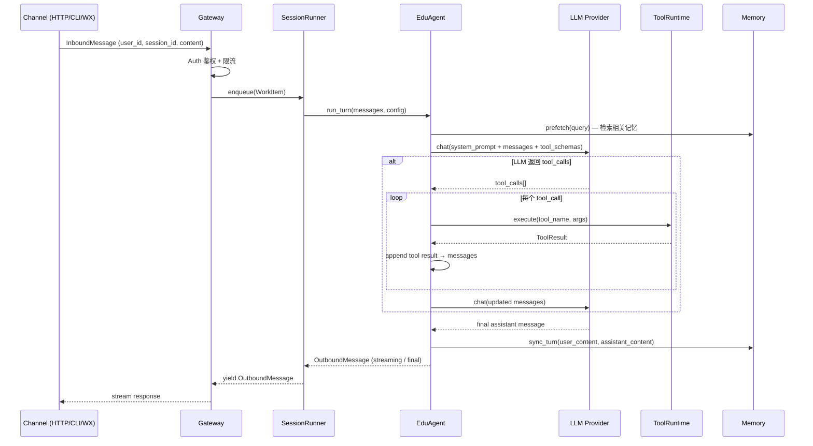

# EduAgent 架构文档

> 基于 Hermes-style ReAct 模式的多轮对话教育 Agent，支持 tools、skills、memory、RAG、MCP 等机制。

---

## 目录

- [EduAgent 架构文档](#eduagent-架构文档)
  - [目录](#目录)
  - [项目概览](#项目概览)
  - [架构总览](#架构总览)
  - [请求流](#请求流)
  - [模块说明](#模块说明)
    - [agent.py](#agentpy)
    - [runner](#runner)
      - [`runner/gateway.py` — Gateway](#runnergatewaypy--gateway)
      - [`runner/session_runner.py` — SessionRunner](#runnersession_runnerpy--sessionrunner)
    - [tools](#tools)
    - [toolsets](#toolsets)
    - [skills](#skills)
      - [文件格式](#文件格式)
      - [渐进式披露（Progressive Disclosure）](#渐进式披露progressive-disclosure)
    - [memory](#memory)
      - [存储布局](#存储布局)
      - [数据模型](#数据模型)
      - [写路径（session 结束时）](#写路径session-结束时)
      - [读路径（每轮 turn 开始时）](#读路径每轮-turn-开始时)
    - [context](#context)
    - [channels](#channels)
    - [mcp](#mcp)
    - [safety](#safety)
    - [subagent](#subagent)
    - [api](#api)
    - [auth](#auth)
    - [sessions](#sessions)
    - [providers](#providers)
  - [模块间数据流](#模块间数据流)
  - [关键调用路径示例](#关键调用路径示例)
    - [示例 1：用户提问 → RAG 检索 → 回答](#示例-1用户提问--rag-检索--回答)
    - [示例 2：技能系统调用](#示例-2技能系统调用)
    - [示例 3：子 Agent 委派](#示例-3子-agent-委派)
  - [配置参考](#配置参考)
  - [目录布局](#目录布局)
  - [改进方向与注意事项](#改进方向与注意事项)
    - [潜在改进](#潜在改进)
    - [注意事项](#注意事项)

---

## 项目概览

**EduAgent** 是一个面向教育场景的 AI Agent，核心目标是：

- 为学习者提供**多轮对话**辅导（概念解释、苏格拉底式引导、题目生成）。
- 基于 **RAG 知识库**回答课程相关知识问题。
- 通过**记忆系统**持续跟踪学习者的掌握状态与偏好，实现个性化辅导。
- 支持**多渠道接入**（CLI、HTTP API、WebSocket、微信等）。
- 通过 **MCP（Model Context Protocol）** 动态扩展外部工具能力。

| 特性 | 说明 |
|------|------|
| 对话模式 | 单轮 / 多轮，流式输出 |
| ReAct 模式 | Hermes-style：LLM → tool\_calls → 执行 → 追加结果 → 循环 |
| 记忆粒度 | Fact → Concept → LearnerProfile（三层聚合） |
| 技能发现 | Skills 目录热加载，支持 YAML frontmatter 元数据 |
| 安全防护 | 输入/输出双向正则过滤 + LLM 安全系统提示 |

---

## 架构总览

```
┌───────────────────────────────────────────────────────────────────────┐
│                         Channel Adapters                               │
│   CLI ──┐  HTTP ──┐  WebSocket ──┐  Weixin ──┐                        │
└─────────┼─────────┼──────────────┼───────────┼────────────────────────┘
          │         │              │           │
          └─────────┴──────────────┴───────────┘
                              │ InboundMessage
                              ▼
                    ┌─────────────────┐
                    │    Gateway      │  路由 + Auth + Runner 生命周期管理
                    └────────┬────────┘
                             │ per-session FIFO
                             ▼
                    ┌─────────────────┐
                    │  SessionRunner  │  asyncio Worker, bounded queue
                    └────────┬────────┘
                             │ AgentConfig
                             ▼
                    ┌─────────────────┐
                    │    EduAgent     │  ReAct 对话循环（多轮）
                    └────────┬────────┘
          ┌──────────────────┼──────────────────┐
          ▼                  ▼                  ▼
  ┌──────────────┐  ┌───────────────┐  ┌─────────────────┐
  │ prompt_builder│  │  ToolRuntime  │  │  MemoryManager  │
  │  (系统提示构建)│  │  (工具执行)    │  │  (记忆读写)      │
  └──────┬───────┘  └──────┬────────┘  └────────┬────────┘
         │                 │                     │
  ┌──────▼──────┐   ┌───────▼──────┐    ┌────────▼────────┐
  │ Skills      │   │ ToolsetRegistry│   │ MemoryStore     │
  │ (技能知识库) │   │ + handlers    │   │ + Extractor     │
  └─────────────┘   └──────────────┘    │ + Consolidator  │
                                        └─────────────────┘
                    ┌─────────────────────────────────────┐
                    │            LLM Provider              │
                    │  (OpenAI-compatible API abstraction) │
                    └─────────────────────────────────────┘
```

---

## 请求流



---

## 模块说明

### agent.py

**EduAgent** — 系统核心，维护会话历史并驱动 ReAct 循环。

| 职责 | 说明 |
|------|------|
| 多轮对话 | 跨 `run_turn()` 调用维护 `messages` 滚动历史 |
| ReAct 循环 | LLM → tool\_calls → 执行 → 追加结果，最多 `max_iterations` 次 |
| 流式输出 | 支持 SSE 流（通过 `AgentCallbacks.on_text_chunk`） |
| 上下文管理 | 调用 `ContextManager` 进行 Token 预算检查与压缩 |
| 安全检查 | 调用 `safety.check_input / check_output` |
| 记忆注入 | 可选地将检索记忆块注入系统提示 |

**关键方法**

```python
async def run_turn(
    user_content: str,
    *,
    session_id: str,
    user_id: str,
    callbacks: AgentCallbacks | None,
) -> AsyncIterator[OutboundMessage]
```

---

### runner

#### `runner/gateway.py` — Gateway

统一入口，负责：
- **鉴权**：调用 `AuthorizationChecker`
- **路由**：为每个 `session_id` 维护一个 `SessionRunner`，LRU 驱逐超过 `max_runners` 的空闲 runner
- **生命周期**：`start_all_adapters()` / `close()` 管理 Channel Adapters
- **空闲超时**：`runner_idle_timeout_sec`（默认 30 分钟）后回收 runner

#### `runner/session_runner.py` — SessionRunner

- **严格 FIFO**：每个 session 独立的 asyncio Worker Task
- **有界队列**：`_in_queue`（入站）、`_out_queue`（出站）防止背压问题
- 内部持有一个 `EduAgent` 实例，转发 `InboundMessage` 并 yield `OutboundMessage`

---

### tools

内置工具模块，注册到全局 `toolset_registry`。

| 模块 | 工具名 | 权限级别 | 说明 |
|------|--------|----------|------|
| `rag.py` | `knowledge_query` | READ | RAG 混合检索知识库 |
| `rag.py` | `generate_quiz` | READ | 按知识库内容生成练习题 |
| `rag.py` | `ingest_document` | WRITE | 导入新文档到知识库 |
| `rag.py` | `build_mindmap` | READ | 生成思维导图 |
| `memory.py` | `remember_fact` | WRITE | 持久化记录一条事实 |
| `memory.py` | `search_memory` | READ | 搜索记忆（概念/事实） |
| `memory.py` | `update_profile_note` | WRITE | 追加学习者画像备注 |
| `skills.py` | `list_skills` | READ | 列出所有可用教学技能（Tier0 索引） |
| `skills.py` | `view_skill` | READ | 获取技能完整内容（Tier1/Tier2） |
| `skills.py` | `manage_skill` | WRITE | 创建/编辑技能文件 |
| `search.py` | `web_search` | NETWORK | Tavily / DuckDuckGo 搜索 |
| `search.py` | `web_fetch` | NETWORK | 抓取网页正文 |
| `search.py` | `wikipedia_search` | NETWORK | 维基百科搜索 |
| `eval.py` | `hint_generator` | READ | 生成苏格拉底式分级提示 |
| `eval.py` | `score_essay` | READ | 作答评分与反馈 |
| `eval.py` | `evaluate_code` | READ | 代码评估与审查 |
| `files.py` | `write_file` | WRITE | 写入 `output/` 目录 |
| `files.py` | `read_file` | READ | 读取 `output/` 目录 |
| `delegation.py` | `delegate_task` | EXECUTE | 委派子任务给 SubAgent |
| `scheduling.py` | `cron_job` | WRITE | 管理定时任务 |
| `ocr.py` | `ocr_image` | READ | 图片 OCR 识别 |

**工具注册流程**

```python
# 每个 tools/*.py 模块顶层调用：
toolset_registry.register(
    ToolSpec(name="knowledge_query", handler=_handle_knowledge_query, ...)
)

# agent 启动时自动发现：
discover_builtin_tools()  # 扫描 tools/*.py，有 register 调用则 importlib.import_module
```

---

### toolsets

工具注册、权限控制与执行运行时。

```
toolsets/
├── registry.py      ← ToolsetRegistry：工具目录（无执行逻辑）
├── models.py        ← ToolSpec、ToolPermission 定义
├── permissions.py   ← PermissionChecker：NETWORK/WRITE/EXECUTE 权限门控
├── runtime.py       ← ToolRuntime：validate → permission → execute(with retry)
└── result_formatter.py ← 统一格式化工具返回内容
```

**权限层次**

| 权限类 | 说明 | 默认 |
|--------|------|------|
| `READ` | 只读操作 | 始终允许 |
| `WRITE` | 文件/记忆写操作 | 需配置开启 |
| `NETWORK` | 外部网络请求 | 需配置开启 |
| `EXECUTE` | 子进程 / 代码执行 | 需配置开启 |
| `APPROVAL_REQUIRED` | 需要用户确认 | `approve_all_tools` 可跳过 |
| `EXTERNAL` | MCP 外部工具 | 需配置开启 |

---

### skills

**技能**是注入 LLM 系统提示的**教学策略知识文档**（非可调用函数）。

#### 文件格式

支持两种格式：

```
skills/
├── socratic.md            ← 扁平文件（向后兼容）
└── scaffolding/
    ├── SKILL.md           ← 目录型（Hermes-style）
    ├── scripts/           ← 可选脚本
    └── references/        ← 可选参考文档
```

SKILL.md 支持 YAML frontmatter：

```yaml
---
name: socratic
description: 苏格拉底式引导法
version: 1.0.0
always_inject: false          # true → 全文始终注入系统提示
triggers: [概念性问题, 原理探究]
requires_tools: [knowledge_query]
platforms: [linux, darwin, windows]
---
... 技能正文 ...
```

#### 渐进式披露（Progressive Disclosure）

| 层级 | 内容 | Token 成本 |
|------|------|------------|
| Tier0 | `<available_skills>` 列表：`name + description` | 低 |
| Tier1 | `view_skill(name)` → 完整 SKILL.md 正文 | 中 |
| Tier2 | `view_skill(name, file_path=...)` → scripts/references | 按需 |

`always_inject: true` 的技能（如 `EDUCATOR.md`）在每轮系统提示中全文注入。

---

### memory

三层记忆聚合架构：`Fact → Concept → LearnerProfile`

```
memory/
├── models.py       ← Fact / Concept / LearnerProfile Pydantic 模型
├── storage.py      ← MemoryStore：文件系统持久化
├── extractor.py    ← MemoryExtractor：LLM 提取会话 → Facts
├── consolidator.py ← MemoryConsolidator：Facts 聚合为 Concepts + Profile
├── retriever.py    ← MemoryRetriever：关键词检索 Concepts/Facts
├── coordinator.py  ← MemoryCoordinator：单 session 记忆生命周期
├── manager.py      ← EduMemoryManager：多 Provider 协调
├── provider.py     ← BuiltinFilesystemMemoryProvider
└── output_scrubber.py ← sanitize_completed_assistant_output（隐私清洗）
```

#### 存储布局

```
memory/
├── facts/{user_id}/{YYYY-MM-DD}.jsonl   ← append-only 事实日志
├── concepts/{user_id}.json              ← 聚合概念掌握度
└── profiles/{user_id}.json              ← 学习者画像
```

#### 数据模型

```python
Fact(
    id, user_id, session_id, timestamp,
    category: FactCategory,  # concept_mastery | concept_confusion | preference | difficulty | question | achievement
    content: str,
    confidence: float,       # 0.0–1.0
    source: FactSource,
)

Concept(
    id, name, description,
    mastery_level: float,    # 0.0–1.0
    supporting_fact_ids,
    related_concepts,
)

LearnerProfile(
    user_id,
    learning_style: "推导式" | "应用式" | "混合",
    pace_preference: "快" | "中" | "慢",
    assistant_notes: list[AssistantNote],
    progress_trend,
    snapshots: list[ProfileSnapshot],
)
```

#### 写路径（session 结束时）

```
Session Messages
      │
      ▼
MemoryExtractor.extract_facts_from_session()
      │ LLM 结构化抽取
      ▼
Facts → MemoryStore.add_fact()  (append-only JSONL)
      │
      ▼
MemoryConsolidator.consolidate_session()
      │ 冲突检测 + 时间衰减加权
      ▼
Concepts + LearnerProfile (JSON 覆写)
```

#### 读路径（每轮 turn 开始时）

```
user query
    │
    ▼
MemoryRetriever.search_concepts(user_id, query, limit=10)
MemoryStore.search_facts(user_id, query, limit=10)
    │
    ▼
prefetch_result → 可选注入 system prompt
```

---

### context

Token 预算管理与上下文压缩。

```
context/
├── calculator.py  ← estimate_tokens / get_context_limit（tiktoken）
├── engine.py      ← TokenBudgetEngine：多信号 Token 预算判断
├── compressor.py  ← compress_messages：摘要压缩 + trim
└── manager.py     ← ContextManager：跨 session 状态管理
```

**压缩策略**

1. `should_compress_pre_check` — 粗略估算预警（日志）
2. `should_compress` — tiktoken 精确计数 × 阈值（`token_limit_percent`）
3. `should_call_llm_summarizer` — 超过摘要触发倍率时调用 LLM 摘要
4. `trim_until_under_token_limit` — 兜底：直接丢弃旧消息

---

### channels

多渠道传输适配层，统一将不同协议转换为 `InboundMessage / OutboundMessage`。

```
channels/
├── base.py      ← ChannelAdapter 抽象基类
├── cli.py       ← CLI 本地交互
├── http.py      ← HTTP 长轮询 / SSE
├── websocket.py ← WebSocket 双向流
└── weixin/      ← 微信公众号 / 企业微信
```

所有 Channel 都调用 `Gateway.process_inbound_message()`，不直接接触 `EduAgent`。

---

### mcp

通过 **Model Context Protocol** 扩展外部工具。

```
mcp/
├── client.py      ← MCPClient：stdio / SSE 传输
├── framing.py     ← JSON-RPC 消息帧
├── loader.py      ← load_mcp_bundles：从 edu_agent.yaml 读取 MCP 服务器配置
└── integration.py ← register_mcp_servers：将 MCP tools 注册为 mcp.<server>.<tool>
```

MCP 工具名格式：`mcp.<server_id>.<tool_name>`，权限类 `EXTERNAL`。

---

### safety

双向安全过滤（纯正则，无网络依赖）。

```python
check_input(text)  → SafetyCheckResult(safe, reason, categories)
check_output(text) → SafetyCheckResult
```

拦截类别：`violence` / `self_harm` / `sexual` / `hate_speech` / `illegal`

触发后返回标准拒绝语并终止本轮对话。

---

### subagent

将复杂子任务委派给隔离的 **SubAgent**，防止污染主对话历史。

| 特性 | 说明 |
|------|------|
| 工具白名单 | `allowed_tools` 精确控制可用工具 |
| 递归防护 | 黑名单中的 `delegate_task` 在子 Agent 内不可调用 |
| 并发限制 | `_MAX_CONCURRENT = 4`（asyncio.Semaphore） |
| 独立上下文 | 不继承主会话 `messages`，使用 `_MINIMAL_SYSTEM` 提示 |

---

### api

基于 **FastAPI** 的 HTTP/WebSocket 接口层。

| 端点 | 方法 | 说明 |
|------|------|------|
| `/v1/sessions` | POST | 创建新会话 |
| `/v1/sessions/{id}` | GET | 获取会话信息 |
| `/v1/sessions/{id}/messages` | POST | 发送消息（支持 stream） |
| `/v1/chat/completions` | POST | OpenAI 兼容接口 |
| `/v1/sessions/{id}/cancel` | POST | 取消当前轮 |
| `/ws/{session_id}` | WS | WebSocket 双向流 |

鉴权通过 `Authorization: Bearer <api_key>` 或 `X-Api-Key` Header。

---

### auth

```
auth/
├── checker.py ← AuthorizationChecker：API Key + Session 归属校验
└── models.py  ← AuthContext(user_id, channel, api_key)
```

---

### sessions

```
sessions/
├── store.py  ← SessionStore：SQLite 持久化会话 + 消息记录
├── models.py ← Session / Message Pydantic 模型
└── schema.py ← 建表 DDL
```

---

### providers

LLM Provider 抽象层，支持多后端切换。

```
providers/
├── registry.py ← ProviderRegistry
├── runtime.py  ← resolve_provider_runtime / build_async_openai_client
├── retry.py    ← 指数退避重试
└── types.py    ← ResolvedProviderRuntime
```

默认 Provider：`dashscope`（阿里云 DashScope，OpenAI 兼容模式）。  
通过 `edu_agent.yaml` 的 `providers:` 块配置多 provider 凭据。

---

## 模块间数据流

```
InboundMessage
    │
    ├─[Channel]──► Gateway ──► SessionRunner ──► EduAgent
    │                                                │
    │                              ┌─────────────────┼──────────────────┐
    │                              ▼                 ▼                  ▼
    │                       PromptBuilder       ToolRuntime        MemoryManager
    │                              │                 │                  │
    │                        skills/         toolset_registry      MemoryStore
    │                        profile         (builtin + MCP)       Extractor
    │                              │                 │              Consolidator
    │                              └────────────┬────┘
    │                                           ▼
    │                                     LLM Provider
    │                                           │
    │                                    final message
    │                                           │
    └───────────────────────────── OutboundMessage ──► Channel
```

---

## 关键调用路径示例

### 示例 1：用户提问 → RAG 检索 → 回答

```
用户: "TCP 三次握手是什么？"
  │
  ▼
EduAgent.run_turn()
  │
  ├─ safety.check_input() → safe
  ├─ ContextManager.load_context() → messages
  ├─ MemoryManager.prefetch("TCP 三次握手") → 相关记忆片段
  ├─ prompt_builder.build_system_prompt() → 含 EDUCATOR.md + 技能索引 + 安全准则
  │
  ▼
LLM(messages + tool_schemas)
  → tool_call: knowledge_query(question="TCP三次握手", sources="course")
  │
  ▼
ToolRuntime.execute("knowledge_query", {...})
  → RAGClient.query() → 返回知识片段
  │
  ▼
LLM(messages + tool_result) → final answer
  │
  ▼
safety.check_output() → safe
MemoryManager.sync_turn() → 异步后台 MemoryExtractor + Consolidator
  │
  ▼
OutboundMessage(content=final_answer) → 返回给用户
```

### 示例 2：技能系统调用

```
用户: "帮我用苏格拉底方法讲解递归"
  │
  ▼
LLM → tool_call: list_skills()
  → ["socratic", "scaffolding", "concept_clarification"]
  │
  ▼
LLM → tool_call: view_skill(name="socratic")
  → 返回完整 socratic.md 正文（Tier1）
  │
  ▼
LLM 按技能指南逐步提问引导
```

### 示例 3：子 Agent 委派

```
主 Agent → tool_call: delegate_task(
    task="搜索今日计算机网络相关新闻并整理",
    allowed_tools=["web_search", "write_file"],
    max_iterations=5
)
  │
  ▼
SubAgent(_MINIMAL_SYSTEM) → web_search → write_file("output/news/...")
  → SubTaskResult(success=True, summary="...")
  │
  ▼
主 Agent 收到结果并向用户汇报
```

---

## 配置参考

通过 `edu_agent.yaml` 配置，主要结构：

```yaml
agent:
  workspace: .          # 工作目录（相对）
  model: qwen-plus-2025-04-28
  provider: dashscope
  temperature: 0.1
  max_tokens: 4096
  max_iterations: 20
  skills_dir: skills

providers:
  dashscope:
    api_key: sk-xxx
    base_url: https://dashscope.aliyuncs.com/compatible-mode/v1
  openai:
    api_key: sk-xxx

tools:
  tavily_api_key: tvly-xxx

toolsets:
  memory: true
  rag: true
  search: true
  files: true
  eval: true
  skills: true
  mcp: true

runtime:
  require_http_key: false
  http_api_key: ""

context:
  model_max_tokens: 32000
  token_limit_percent: 0.85
  compression_enabled: true
```

对应的 Pydantic 模型：`EduSettings`（`config.py`）。

---

## 目录布局

```
src/edu_agent/
├── agent.py               ← EduAgent ReAct 循环
├── subagent.py            ← SubAgent 隔离委派
├── prompt_builder.py      ← 系统提示构建
├── skills_loader.py       ← 技能文件加载 + frontmatter 解析
├── safety.py              ← 输入/输出安全过滤
├── runtime_context.py     ← TurnRuntimeContext（ContextVar）
├── config.py              ← EduSettings Pydantic 模型
├── config_loader.py       ← YAML → EduSettings
├── types.py               ← ToolResult / AgentConfig / AgentCallbacks
├── paths.py               ← EduPaths（目录路径集合）
├── tool_payloads.py       ← tool_result / tool_error 快捷构造
├── learner_profile.py     ← 画像加载 / 摘要
├── cron.py                ← CronManager 定时任务
│
├── runner/                ← Gateway + SessionRunner
├── api/                   ← FastAPI 应用工厂
├── channels/              ← CLI / HTTP / WebSocket / Weixin 适配器
├── auth/                  ← 鉴权
├── bus/                   ← InboundMessage / OutboundMessage 消息总线模型
├── sessions/              ← 会话 + 消息 SQLite 存储
├── providers/             ← LLM Provider 抽象
├── llm_tools/             ← tool_specs_to_openai_tools 格式转换
│
├── tools/                 ← 内置工具实现（每个文件一个 toolset）
├── toolsets/              ← 工具注册 / 权限 / 运行时
├── skills/                ← 教学技能文档（运行时目录，非代码）
│
├── memory/                ← 三层记忆系统
├── context/               ← Token 预算 + 上下文压缩
└── mcp/                   ← MCP 客户端 + 集成
```

---

## 改进方向与注意事项

### 潜在改进

| 方向 | 描述 |
|------|------|
| 记忆向量化 | 当前 `search_memory` 仅关键词匹配，可引入向量嵌入实现语义检索 |
| 技能触发自动化 | `triggers` 字段已声明但未用于自动注入，可实现意图识别自动激活技能 |
| 多 Provider 负载均衡 | 当前仅单 provider per turn，可实现故障转移或成本优化路由 |
| SubAgent 结果缓存 | 相同任务重复委派时，可引入短时缓存避免冗余 LLM 调用 |
| RAG 增量更新 | `ingest_document` 同步阻塞，大文档导入可异步化 |
| Session 分布式 | 当前 `SessionStore` 基于 SQLite，扩展至多节点需替换为 Redis / PostgreSQL |

### 注意事项

- **工具权限**：`WRITE` / `NETWORK` / `EXECUTE` 类工具默认关闭，需在 `edu_agent.yaml` 中显式开启，避免意外数据写入或网络请求。
- **MCP 工具安全**：外部 MCP 服务器注册的工具权限为 `EXTERNAL`，需确保 MCP 服务来源可信。
- **记忆隐私**：`output_scrubber.py` 仅做基础清洗，敏感数据（身份证、手机号等）应在应用层入口拦截。
- **SubAgent 递归**：`delegate_task` 已加入 `_RECURSION_BLACKLIST`，但 SubAgent 内调用其他工具仍可能间接触发长耗时操作，需关注 `max_iterations` 上限设置。
- **上下文压缩**：LLM 摘要压缩会丢失细节，长对话中建议定期存档会话或提示用户开始新会话。
- **安全过滤局限**：正则过滤仅覆盖已知模式，微妙有害内容依赖 LLM safety prompt，两者需配合使用。
