# 基于大模型与知识图谱的智能教育辅助平台

---

[TOC]

## （二）业务流程分析

本系统围绕"教师授课—材料处理—学生学习—AI辅助—数据分析"的核心闭环设计业务流程。系统涉及三类主体：**教师**（课程与材料的所有者）、**学生**（学习与提问的执行者）、**管理员**（用户与凭证的管理者），以及一个外部依赖：**大语言模型（LLM）服务**。以下分别从整体流程、材料处理子流程和 AI 问答子流程三个粒度进行阐述。

---

### 1. 系统整体业务流程图

图 2-1 采用泳道图（Swimlane Diagram）呈现各主体的业务交互，横向分为教师、学生、管理员、系统（后端）四条泳道。

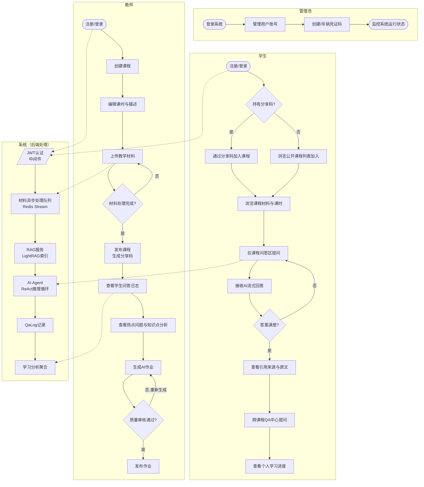

**说明：**

教师首先注册并登录系统，通过创建课程和编辑课时构建课程结构，再将 PDF、PPT、Word、视频等多格式教学材料上传至系统。系统后台异步完成材料解析与知识库构建；待材料状态变为"就绪"后，教师发布课程并将分享码提供给学生。课程发布后，教师可随时查看学生问答日志与热点问题，并触发 AI 作业生成流程，经质量审核后发布给学生。

学生登录后通过分享码加入课程，浏览材料库与课时内容，并在课程问答区向 AI 助手提问；系统以流式方式返回带引用来源的回答，学生可点击引用跳转至原始材料页面。此外，学生可在跨课程 QA 中心发起综合性提问，并通过学习进度页查看个人知识掌握情况。

---

### 2. 教学材料处理子流程

材料处理是系统的核心异步流程，涉及文件存储、格式解析、向量化索引等多个环节。如图 2-2 所示：

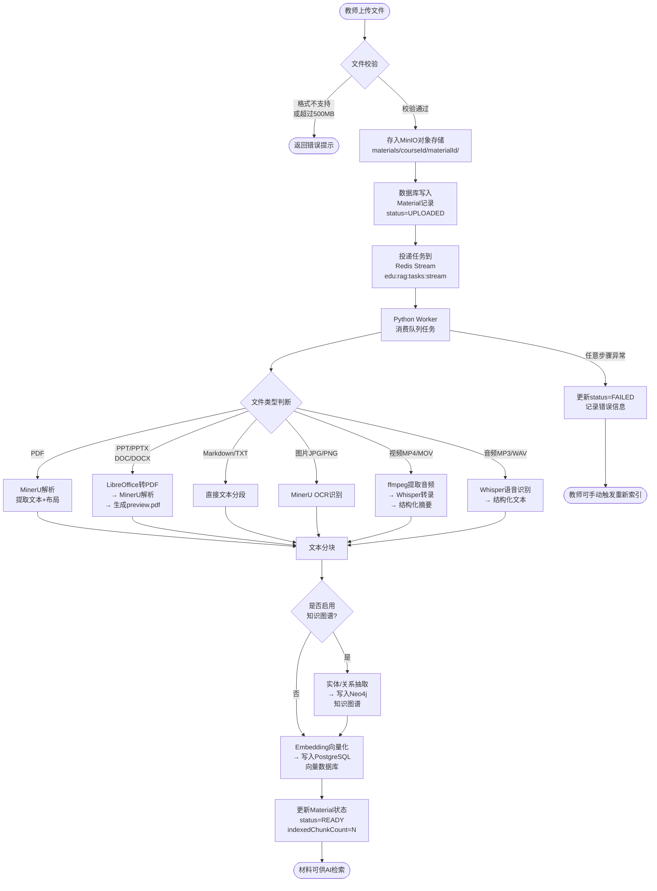

**说明：**

文件上传后首先在 Next.js API 层完成格式校验（支持 PDF、PPT/PPTX、DOC/DOCX、MD/TXT、JPG/PNG、MP4/MOV 等，大小上限 500 MB），校验通过后以流式写入 MinIO 对象存储，同时在数据库创建 `status=UPLOADED` 的 Material 记录，并向 Redis Stream `edu:rag:tasks:stream` 投递处理任务。

Python Worker 持续消费队列，根据文件类型选择对应处理策略：Office 文件先由 LibreOffice 转为 PDF 以生成预览版本，再经 MinerU 提取结构化文本；视频/音频文件经 Whisper 模型转录后生成结构化摘要；图片文件通过 MinerU OCR 识别。

所有类型最终汇聚到分块与索引阶段：文本被切分为语义连贯的 chunk，可选择性地抽取实体关系写入 Neo4j 知识图谱，随后生成 Embedding 向量存入 PostgreSQL pgvector 数据库。全流程完成后将 Material 状态更新为 `READY`，任意环节失败则记录 `FAILED` 状态与错误原因，支持教师手动重试。

---

### 3. AI 智能问答子流程

系统采用基于 ReAct（Reasoning + Acting）范式的 Agent 架构，将 LLM 推理与工具调用交织执行，如图 2-3 所示：

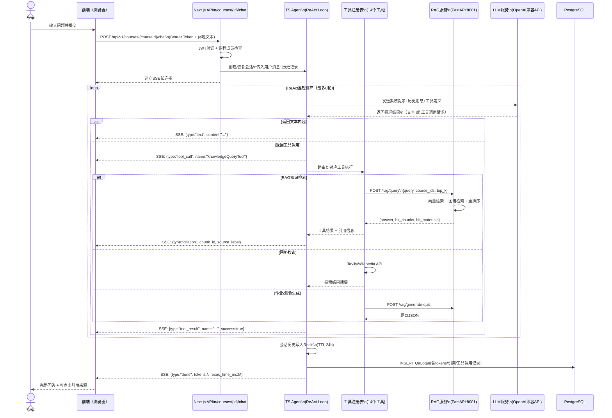

**说明：**

学生提交问题后，前端以 HTTP POST 发送到 Next.js API，服务端验证 JWT 令牌并确认学生的课程成员资格后，初始化 TS Agent 会话（新会话或从 Redis 恢复历史会话），并向前端建立 SSE（Server-Sent Events）长连接，实现流式推送。

Agent 进入 ReAct 推理循环（上限 8 轮），每轮将系统提示、用户画像、历史消息和工具定义一并发送给 LLM。若 LLM 返回普通文本，则直接通过 SSE 推送至前端；若返回工具调用请求，则路由到对应工具执行——知识查询工具（`knowledgeQueryTool`）调用 RAG 服务执行混合检索，将命中的文档片段及来源信息以引用事件（`citation`）推送给前端，学生可点击查看原文。

每次对话结束后，Agent 将更新后的会话历史写入 Redis（TTL 24 小时），并在 PostgreSQL 中持久化 QaLog 记录，保存问答内容、Token 消耗、执行时长及工具调用详情，供后续学习分析使用。

---

## （三）数据流程分析

数据流程分析（DFD，Data Flow Diagram）从数据视角描述系统中数据的流动与变换过程。本节采用结构化分析方法，自顶向下分三层逐级展开，并附数据字典对核心数据流加以说明。

> **符号约定**：矩形表示外部实体，圆角矩形（或椭圆）表示数据处理，开口矩形表示数据存储，箭头表示数据流。

---

### 1. 顶层数据流程图（0 层图）

顶层图将整个系统视为一个处理过程，仅描述系统与外部实体之间的数据交换边界，如图 3-1 所示。

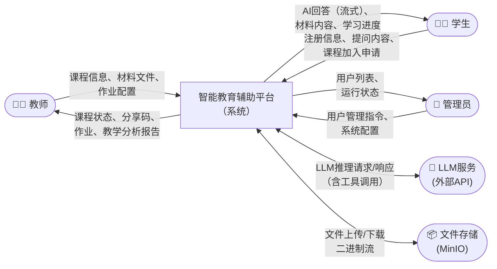

**说明：** 系统接受来自教师的课程与材料数据、来自学生的学习与问答请求、来自管理员的配置指令，同时与外部 LLM 服务进行双向通信（发送推理请求、接收生成结果），并通过 MinIO 对象存储完成材料文件的持久化读写。所有对外交互均以认证令牌（JWT）为前提。

---

### 2. 第一层数据流程图

将顶层处理分解为六个子系统：用户管理（P1）、课程管理（P2）、材料处理（P3）、AI 问答（P4）、作业管理（P5）、统计分析（P6），如图 3-2 所示。

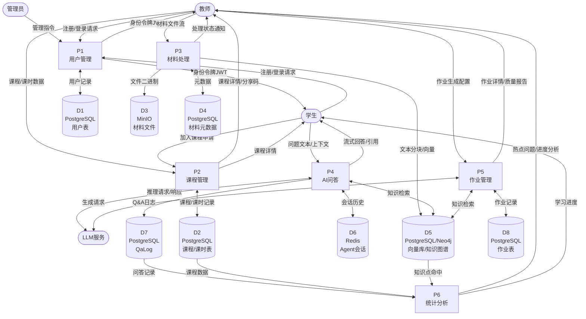

**说明：** 六个子系统共享以 PostgreSQL 为核心的持久化存储，其中用户表（D1）、课程表（D2）、材料元数据表（D4）、QaLog 表（D7）、作业表（D8）存于 PostgreSQL；材料文件二进制（D3）存于 MinIO；向量数据及知识图谱（D5）分存于 PostgreSQL pgvector 和 Neo4j；Agent 会话历史（D6）存于 Redis（TTL 24h）。P3 材料处理通过 Redis Stream 解耦前台上传与后台索引任务。

---

### 3. 第二层数据流程图

对第一层中最复杂的三个子系统——材料处理（P3）、AI 问答（P4）、作业管理（P5）——进一步展开。

#### 3.1 材料处理子系统（P3 展开）

```mermaid
flowchart TD
    E1(["教师"])
    DS3[("MinIO\n文件存储")]
    DS4[("材料元数据\nPostgreSQL")]
    DS5[("向量库/知识图谱\nPostgreSQL+Neo4j")]
    RQ[("Redis Stream\nedu:rag:tasks:stream")]

    P31["P3.1\n文件接收\n与校验"]
    P32["P3.2\n文件存储"]
    P33["P3.3\n任务入队"]
    P34["P3.4\n格式解析\n(MinerU/Whisper)"]
    P35["P3.5\n文本分块"]
    P36["P3.6\n向量化\n与索引"]
    P37["P3.7\n状态更新"]

    E1 -->|"文件流 + 元信息\n(filename,size,type)"| P31
    P31 -- "格式/大小校验失败" --> E1
    P31 -->|"合法文件流"| P32
    P32 -->|"对象写入\nmaterials/cid/mid/"| DS3
    P32 -->|"INSERT Material\nstatus=UPLOADED"| DS4
    P32 -->|"物理路径"| P33
    P33 -->|"任务消息\n{materialId,type}"| RQ
    RQ -->|"Worker消费"| P34
    P34 -->|"结构化文本块\n+页面图像URL"| P35
    P35 -->|"语义分块列表"| P36
    P36 -->|"向量+实体关系"| DS5
    P36 -->|"chunk数量"| P37
    P37 -->|"UPDATE status=READY\nindexedChunkCount=N"| DS4
    P37 -->|"处理完成通知"| E1
    P34 -- "解析失败" --> P37
    P37 -- "失败" -->|"UPDATE status=FAILED\nstatusMessage"| DS4
```

#### 3.2 AI 问答子系统（P4 展开）

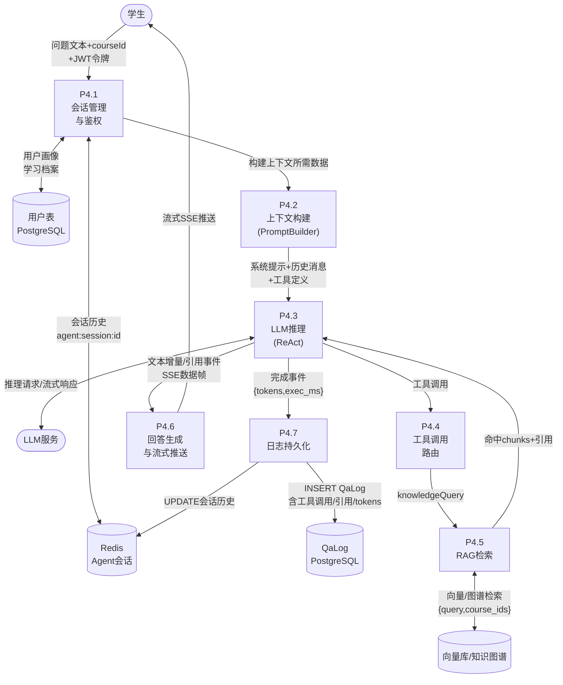

#### 3.3 作业管理子系统（P5 展开）

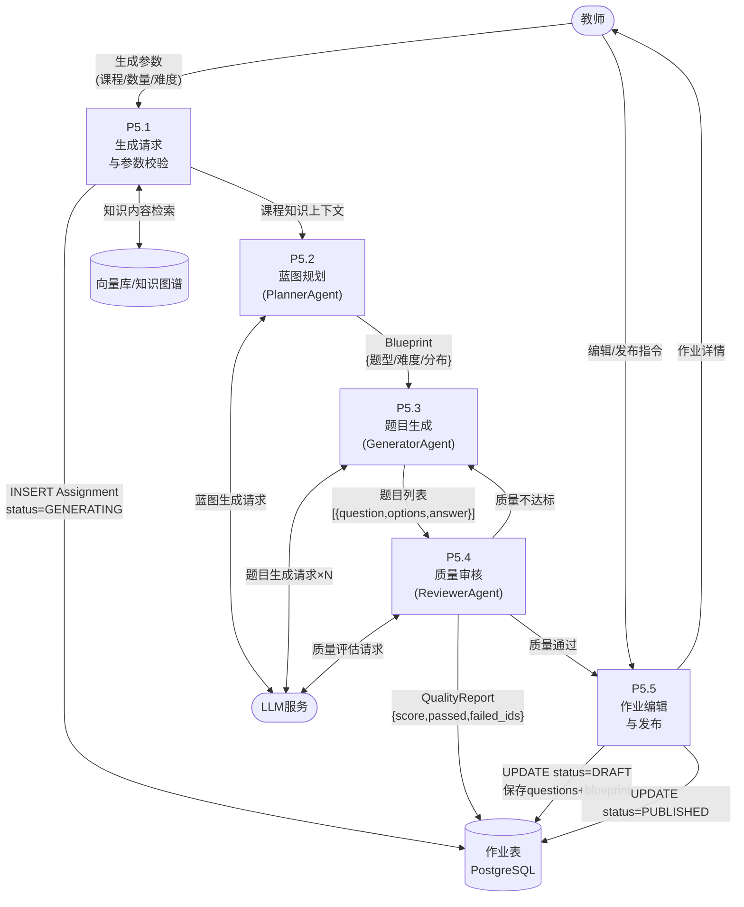

---

### 4. 数据字典

数据字典对系统中关键数据流和数据存储的结构进行规范化定义，以下列出 8 条核心条目。

#### 数据流条目

| 编号 | 数据流名称 | 来源 | 去向 | 组成描述 |
|------|-----------|------|------|---------|
| DF-01 | 材料上传请求 | 教师（浏览器） | P3.1 文件接收 | `file`（二进制流）+ `courseId`（UUID）+ `lessonId`（UUID，可选）+ `Content-Type`（multipart/form-data） |
| DF-02 | RAG任务消息 | P3.3 任务入队 | Redis Stream | `materialId`（UUID）+ `task_type`（parse_and_index \| convert_preview \| transcribe_and_index）+ `course_id`（UUID）+ `minio_path`（字符串） |
| DF-03 | 知识检索请求 | P4.4 工具路由 | RAG服务 | `query`（字符串）+ `course_ids`（UUID数组）+ `retrieval_mode`（hybrid \| course \| personal）+ `top_k`（整数，默认10） |
| DF-04 | SSE事件帧 | P4.6 回答生成 | 学生浏览器 | `type`（text \| citation \| tool_call \| tool_result \| done）+ `content`（字符串）\| `chunk_id` + `source_label` + `image_urls` |
| DF-05 | 问答日志 | P4.7 日志持久化 | D7 QaLog表 | 见数据存储 DS-03 |

#### 数据存储条目

| 编号 | 存储名称 | 存储介质 | 主要字段 |
|------|---------|---------|---------|
| DS-01 | 材料元数据 | PostgreSQL `Material` | `id`（UUID PK）、`courseId`（外键）、`originalFilename`、`fileType`、`minioPath`、`status`（UPLOADED\|PARSING\|PARSED\|INDEXING\|READY\|FAILED）、`indexedChunkCount`（整数）、`statusMessage`（varchar） |
| DS-02 | Agent会话历史 | Redis Key `agent:session:{id}` | JSON序列化的 `Message[]`，含 `role`（user\|assistant\|tool）、`content`、`tool_calls`；TTL 86400秒（24h） |
| DS-03 | 问答日志 | PostgreSQL `QaLog` | `id`（UUID PK）、`studentId`（外键）、`courseId`（外键，可空）、`question`（text）、`answer`（text）、`questionTokens`、`answerTokens`、`executionTimeMs`、`hitChunks`（JSON数组）、`toolCalls`（JSON数组）、`citations`（JSON数组） |

---


## 三、系统设计

### （一）概要设计

概要设计阶段依据需求分析的结果，将系统划分为相互独立、职责清晰的功能模块，形成系统的总体功能结构。本系统按照"高内聚、低耦合"的原则共划分为 **6 个一级子系统、22 个功能模块**，如图 4-1 所示。

```mermaid
graph TD
    SYS["🎓 智能教育辅助平台"]

    SYS --> M1["1️⃣ 用户认证与管理"]
    SYS --> M2["2️⃣ 课程与课时管理"]
    SYS --> M3["3️⃣ 教学材料管理"]
    SYS --> M4["4️⃣ AI 智能问答"]
    SYS --> M5["5️⃣ AI 作业生成"]
    SYS --> M6["6️⃣ 学习分析与统计"]

    M1 --> M1a["用户注册"]
    M1 --> M1b["用户登录/登出"]
    M1 --> M1c["JWT令牌管理\n(Access+Refresh双令牌)"]
    M1 --> M1d["用户信息维护\n(个人资料/密码修改)"]
    M1 --> M1e["隐私控制\n(QA日志收集开关)"]

    M2 --> M2a["课程创建/编辑/删除"]
    M2 --> M2b["课程生命周期管理\n(DRAFT→PUBLISHED→ARCHIVED)"]
    M2 --> M2c["课时管理\n(创建/排序/删除)"]
    M2 --> M2d["学生选课\n(分享码/直接加入)"]
    M2 --> M2e["协作教师管理"]

    M3 --> M3a["多格式材料上传\n(PDF/Office/视频/音频/图片)"]
    M3 --> M3b["异步处理与状态追踪\n(UPLOADED→READY)"]
    M3 --> M3c["材料预览\n(PDF/Office在线预览)"]
    M3 --> M3d["材料删除与重索引"]

    M4 --> M4a["课程内问答\n(RAG增强)"]
    M4 --> M4b["跨课程QA中心"]
    M4 --> M4c["ReAct推理循环\n(工具调用编排)"]
    M4 --> M4d["Agent记忆系统\n(事实/概念/学习档案)"]
    M4 --> M4e["定时Agent任务\n(CronJob)"]

    M5 --> M5a["蓝图规划\n(PlannerAgent)"]
    M5 --> M5b["题目批量生成\n(GeneratorAgent)"]
    M5 --> M5c["质量审核\n(ReviewerAgent)"]
    M5 --> M5d["作业编辑与发布"]

    M6 --> M6a["热点问题分析\n(TOP15)"]
    M6 --> M6b["知识点命中统计"]
    M6 --> M6c["学生学习进度\n(掌握度/薄弱点)"]
    M6 --> M6d["问答日志导出\n(GDPR合规)"]
```

**模块职责说明：**

- **用户认证与管理（M1）**：负责用户的身份注册与验证，采用 Argon2id 算法加密存储密码，JWT 双令牌机制（15 分钟 Access Token + 7 天 Refresh Token）保障无感刷新。
- **课程与课时管理（M2）**：提供课程的完整生命周期管理，支持多教师协作，分享码机制允许学生快速入课。
- **教学材料管理（M3）**：支持 PDF、Office、视频、音频、图片等 6 类格式，通过 Redis Stream 异步队列解耦上传与处理，LightRAG 完成知识库构建。
- **AI 智能问答（M4）**：核心模块，基于 ReAct 范式驱动 14 个工具执行，并集成三层记忆系统（事实记忆、概念记忆、学习档案）实现个性化辅导；CronJob 为定时 Agent 任务提供支撑。
- **AI 作业生成（M5）**：三阶段流水线（规划—生成—审核）确保作业质量，支持题目的单独重生成与质量评分反馈。
- **学习分析与统计（M6）**：基于 QaLog 数据聚合分析，为教师提供教学决策支持，为学生提供个性化学习路径建议。

---

### （二）详细设计

针对各功能模块，绘制处理流程图，描述模块内部的核心处理逻辑。

---

#### 模块 1：用户认证模块处理流程

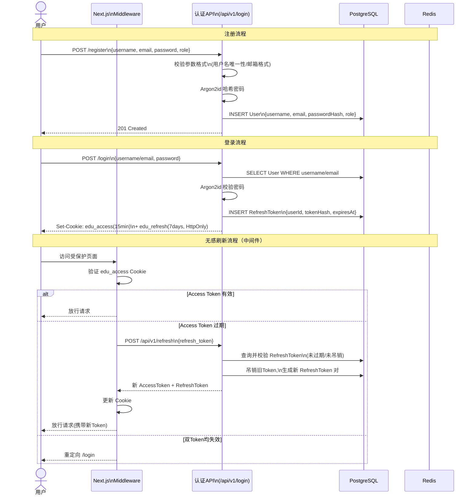

**说明：** 密码采用 Argon2id 算法哈希存储（内存硬化，抵抗 GPU 暴力破解），RefreshToken 以哈希值存储于数据库，每次使用后轮换（Rotate-on-use），防止令牌泄露导致的重放攻击。中间件在 Next.js Edge Runtime 中运行，对所有 `/app` 路由自动执行 JWT 校验与无感刷新。

---

#### 模块 2：课程管理模块处理流程

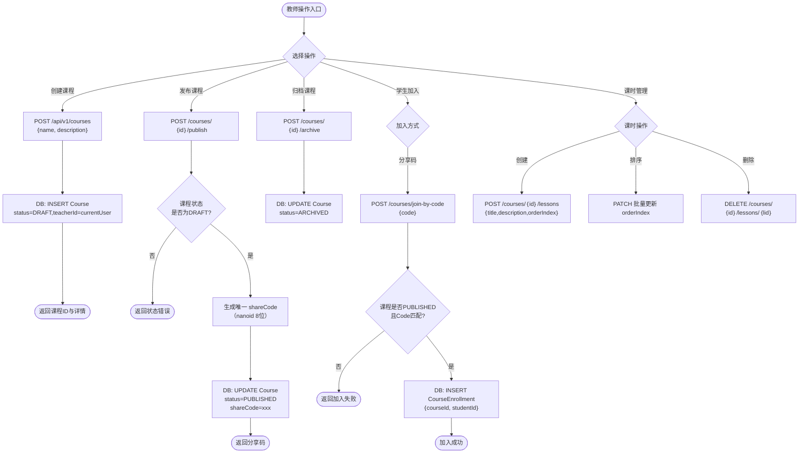

---

#### 模块 3：教学材料处理模块处理流程

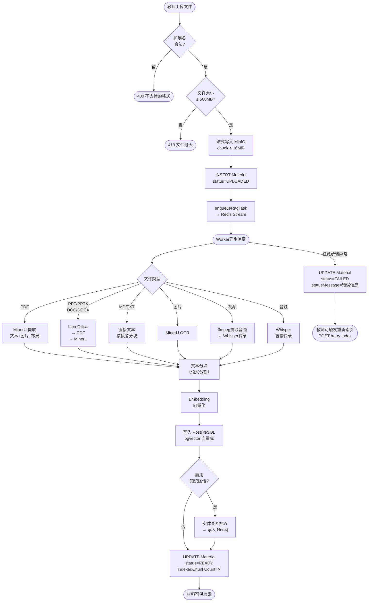

---

#### 模块 4：AI 智能问答模块处理流程

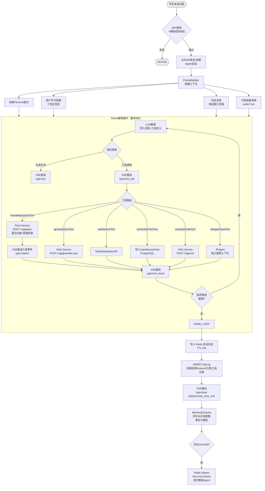

**说明：** CronJob 定时任务作为 AI Agent 的扩展功能，由教师或学生创建调度规则（Cron 表达式或"every Xm"形式），Worker 消费 `edu:cron:stream` 后在独立上下文中驱动 Agent 执行任务（如定期整理学习笔记、批量评估作业），结果记录于 `CronJobRun` 表。

---

#### 模块 5：AI 作业生成模块处理流程

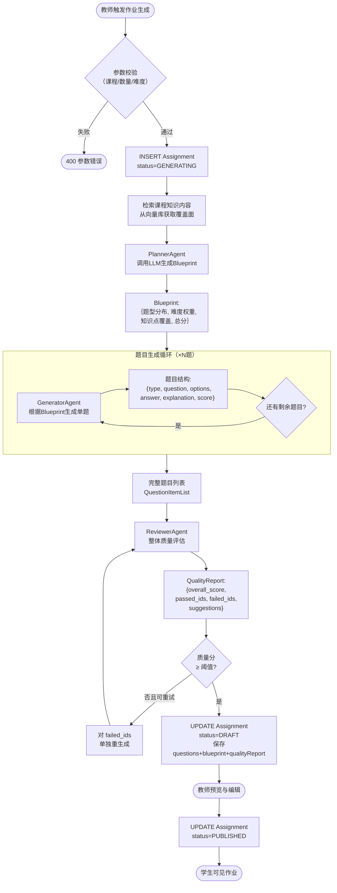

---

#### 模块 6：学习分析模块处理流程

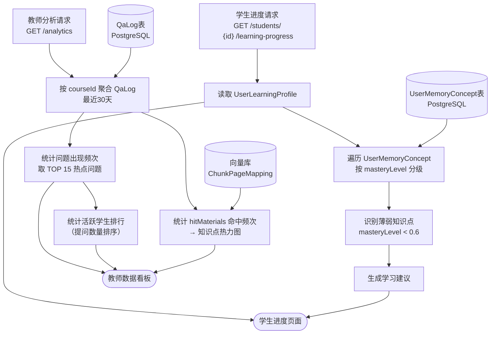

---


### （三）数据库设计

#### 1. E-R 图

系统共设计 19 个数据表，核心实体及其关系如图 5-1 所示（采用 Mermaid `erDiagram` 语法）。

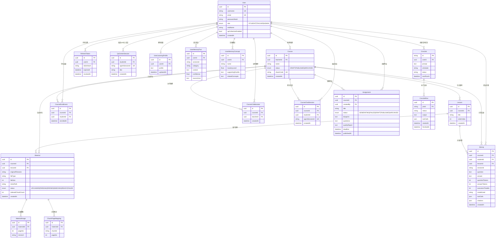

---

#### 2. 数据表设计

##### 2.1 用户表（users）

| 字段名 | 数据类型 | 约束 | 说明 |
|--------|---------|------|------|
| id | UUID | PK | 用户唯一标识，系统自动生成 |
| username | VARCHAR(255) | UNIQUE, NOT NULL | 用户名，用于登录 |
| email | VARCHAR(255) | UNIQUE, NOT NULL | 电子邮箱，用于登录 |
| password_hash | VARCHAR(255) | NOT NULL | Argon2id 哈希后的密码 |
| role | ENUM | NOT NULL | 角色：STUDENT / TEACHER / ADMIN |
| real_name | VARCHAR(255) | NULL | 真实姓名（可选） |
| avatar_url | TEXT | NULL | 头像 URL |
| qa_collection_enabled | BOOLEAN | DEFAULT true | 是否允许收集 QA 日志（隐私控制） |
| qa_collection_notice_accepted_at | TIMESTAMP | NULL | 用户接受隐私协议的时间戳 |
| is_active | BOOLEAN | DEFAULT true | 账号是否有效（软禁用） |
| created_at | TIMESTAMP | NOT NULL | 注册时间 |
| updated_at | TIMESTAMP | NOT NULL | 最近更新时间（自动维护） |

**索引**：`username`（唯一），`email`（唯一）

---

##### 2.2 课程表（courses）

| 字段名 | 数据类型 | 约束 | 说明 |
|--------|---------|------|------|
| id | UUID | PK | 课程唯一标识 |
| teacher_id | UUID | FK → users.id, NOT NULL | 课程所属教师 |
| name | VARCHAR(255) | NOT NULL | 课程名称 |
| description | TEXT | NULL | 课程简介 |
| cover_image_url | TEXT | NULL | 封面图 URL |
| status | ENUM | NOT NULL, DEFAULT DRAFT | 课程状态：DRAFT / PUBLISHED / ARCHIVED |
| share_code | VARCHAR(64) | UNIQUE, NULL | 发布后自动生成的分享码（nanoid 8位） |
| is_deleted | BOOLEAN | DEFAULT false | 软删除标记 |
| created_at | TIMESTAMP | NOT NULL | 创建时间 |
| updated_at | TIMESTAMP | NOT NULL | 更新时间 |

**索引**：`teacher_id`，`share_code`（唯一）  
**级联**：teacher_id 删除时，课程一并删除（ON DELETE CASCADE）

---

##### 2.3 教学材料表（materials）

| 字段名 | 数据类型 | 约束 | 说明 |
|--------|---------|------|------|
| id | UUID | PK | 材料唯一标识 |
| course_id | UUID | FK → courses.id, NOT NULL | 所属课程 |
| lesson_id | UUID | FK → lessons.id, NULL | 所属课时（可选） |
| original_filename | VARCHAR(512) | NOT NULL | 上传时的原始文件名 |
| file_type | VARCHAR(32) | NOT NULL | 文件类型（pdf / pptx / mp4 等） |
| file_size | INTEGER | NOT NULL | 文件大小（字节） |
| minio_path | VARCHAR(1024) | NOT NULL | MinIO 对象路径，如 `materials/{courseId}/{materialId}/{filename}` |
| preview_pdf_status | ENUM | DEFAULT NA | Office 转 PDF 预览状态：NA / PENDING / READY / FAILED |
| status | ENUM | NOT NULL, DEFAULT UPLOADED | 处理状态：UPLOADED / PARSING / PARSED / INDEXING / READY / FAILED |
| status_message | TEXT | NULL | 失败时的错误信息描述 |
| indexed_chunk_count | INTEGER | DEFAULT 0 | 成功写入向量库的分块数量 |
| is_deleted | BOOLEAN | DEFAULT false | 软删除标记 |
| created_at | TIMESTAMP | NOT NULL | 上传时间 |
| updated_at | TIMESTAMP | NOT NULL | 状态更新时间 |

**索引**：`(course_id, status)`（复合索引，支持按课程筛选待处理材料）

---

##### 2.4 问答日志表（qa_logs）

| 字段名 | 数据类型 | 约束 | 说明 |
|--------|---------|------|------|
| id | UUID | PK | 日志唯一标识 |
| student_id | UUID | FK → users.id, NOT NULL | 提问学生 |
| course_id | UUID | FK → courses.id, NULL | 所属课程（跨课程提问时为空） |
| lesson_id | UUID | FK → lessons.id, NULL | 相关课时（可选） |
| session_id | VARCHAR(255) | NOT NULL | Agent 会话 ID，关联 Redis 会话 |
| question | TEXT | NOT NULL | 用户提问原文 |
| answer | TEXT | NULL | AI 生成的回答 |
| question_tokens | INTEGER | NULL | 问题消耗的 token 数 |
| answer_tokens | INTEGER | NULL | 回答消耗的 token 数 |
| total_tokens | INTEGER | NULL | 本次对话总 token 数 |
| execution_time_ms | INTEGER | NOT NULL | Agent 执行耗时（毫秒） |
| model_used | VARCHAR(100) | NOT NULL | 使用的 LLM 模型名称 |
| hit_chunks | TEXT[] | DEFAULT [] | 命中的向量分块 ID 列表 |
| hit_materials | TEXT[] | DEFAULT [] | 命中的材料 ID 列表 |
| hit_sources | TEXT[] | DEFAULT [] | 命中的来源描述列表 |
| tool_calls | JSONB | DEFAULT [] | 工具调用记录数组（name/status/duration） |
| citations | JSONB | DEFAULT [] | 引用信息数组（chunk_id/source_label/image_urls） |
| response_quality | SMALLINT | NULL | 学生评分（1-5，可选） |
| is_helpful | BOOLEAN | NULL | 学生是否认为回答有帮助 |
| agent_feedback | TEXT | NULL | Agent 自评或补充信息 |
| metadata | JSONB | NULL | 扩展元数据（用于调试与审计） |
| created_at | TIMESTAMP | NOT NULL | 记录时间 |
| deleted_at | TIMESTAMP | NULL | 软删除时间（支持 GDPR 删除请求） |

**索引**：`(course_id, created_at DESC)`，`(student_id, created_at DESC)`，`session_id`

---

##### 2.5 作业表（assignments）

| 字段名 | 数据类型 | 约束 | 说明 |
|--------|---------|------|------|
| id | UUID | PK | 作业唯一标识 |
| course_id | UUID | FK → courses.id, NOT NULL | 所属课程 |
| created_by | UUID | FK → users.id, NOT NULL | 创建教师 |
| title | VARCHAR(255) | NOT NULL | 作业标题 |
| description | TEXT | NULL | 作业说明 |
| status | ENUM | DEFAULT GENERATING | 状态：GENERATING / FAILED / DRAFT / PUBLISHED / ARCHIVED |
| error_message | TEXT | NULL | 生成失败时的错误信息 |
| blueprint | JSONB | NULL | PlannerAgent 输出的作业蓝图（题型分布、难度权重等） |
| questions | JSONB | NULL | GeneratorAgent 输出的题目数组（含题目/选项/答案/解析） |
| quality_report | JSONB | NULL | ReviewerAgent 输出的质量报告（总分/通过题/失败题/建议） |
| deadline | TIMESTAMP | NULL | 截止时间 |
| published_at | TIMESTAMP | NULL | 发布时间 |
| created_at | TIMESTAMP | NOT NULL | 创建时间 |
| updated_at | TIMESTAMP | NOT NULL | 更新时间 |

**索引**：`(course_id, status)`，`(course_id, created_at DESC)`

---

##### 2.6 其他数据表简述

| 表名 | 主要功能 | 关键字段 |
|------|---------|---------|
| lessons | 课时信息 | courseId, title, orderIndex（排序号） |
| course_enrollments | 学生-课程选课关系 | courseId, studentId（联合唯一） |
| course_collaborators | 课程协作教师 | courseId, teacherId（联合唯一） |
| material_images | 材料页面截图 | materialId, pageIdx, minioUrl |
| chunk_page_mappings | 向量分块到页面映射 | materialId, chunkId, pageIdx（支持引用定位） |
| refresh_tokens | JWT 刷新令牌 | userId, tokenHash, expiresAt, revokedAt |
| course_chat_sessions | 课程 AI 会话 | courseId, studentId, agentSessionId（唯一，1对1映射） |
| qa_center_sessions | 跨课程 QA 会话 | studentId, agentSessionId（唯一） |
| chat_thread_title_overrides | 自定义会话标题 | studentId, sessionId, title |
| user_learning_profiles | 学生学习档案 | userId（唯一），profile（JSON） |
| user_memory_facts | Agent 记忆事实 | userId, sessionId, category, content, confidence |
| user_memory_concepts | 知识点掌握度 | userId, name（联合唯一），masteryLevel（0-1浮点） |
| cron_jobs | 定时 Agent 任务 | userId, schedule（cron表达式），status，nextRunAt |
| cron_job_runs | 定时任务执行记录 | jobId, status, output, toolCalls, startedAt |

---

## 四、系统实现

### （一）系统的主要界面

#### 1. 用户注册与登录页面

> **[截图占位：登录/注册页面]**

登录页面（`/login`）提供用户名或邮箱两种登录方式，配合密码输入框完成身份验证；注册页面（`/register`）新增角色选择字段（教师/学生），支持不同角色进入差异化的系统界面。表单均附有前端格式校验，防止无效请求发送至服务端。

---

#### 2. 课程列表页面

> **[截图占位：课程列表-教师视角]**

课程列表页（`/courses`）以 Card Grid 布局展示当前用户的所有课程。教师可通过右上角按钮创建新课程；每个课程卡片显示课程名称、状态标签（草稿/已发布/已归档）、材料数量及封面图。学生视角下卡片额外显示加入日期，并提供通过分享码加入的入口。

---

#### 3. 教学材料管理界面

> **[截图占位：材料管理页面]**

材料管理页（`/courses/{id}/materials`）分为两栏：左侧为课时导航树，右侧为当前选中课时的材料列表。每条材料显示文件名、文件类型图标、处理状态（进度条或状态标签）、分块数量。支持拖拽上传与状态轮询刷新，对处于 FAILED 状态的材料提供"重新索引"按钮。

---

#### 4. AI 智能问答界面

> **[截图占位：课程问答-分屏布局]**

课程问答页（`/courses/{id}/chat`）采用 Dockview 多窗口分屏布局：左侧为课程材料列表与预览面板（PDF 内联预览、视频播放），右侧为聊天窗口。聊天区展示消息历史、工具调用指示卡（如"正在检索知识库…"）、流式文字渲染及引用来源卡片。学生点击引用卡片可跳转至对应材料的具体页面。

---

#### 5. AI 作业生成与管理界面

> **[截图占位：作业生成-题目预览]**

作业管理页（`/courses/{id}/assignments`）以列表展示该课程下所有作业，状态颜色区分（生成中/草稿/已发布）。进入作业详情后，教师可逐题预览题目内容（含选项、答案、解析），对不满意的题目单独触发重生成，并查看 ReviewerAgent 给出的质量评分报告（含总分与各题分析），确认无误后点击"发布"使学生可见。

---

#### 6. 学习分析仪表板

> **[截图占位：教学分析-热点问题]**

分析仪表板（`/courses/{id}/analytics`）为教师提供两类核心视图：**热点问题 TOP15** 以条形图展示最高频提问，辅助教师识别学生困惑点；**知识点命中热力图**（`/analytics/knowledge`）以色块深浅反映各材料/知识点被检索的频次，支持教师调整教学重点。学生端进度页（`/me/progress`）以雷达图展示各知识点的掌握度（来自 `UserMemoryConcept.masteryLevel`），突出显示薄弱知识点并给出复习建议。

---

### （二）主要的功能代码

#### 1. ReAct 推理循环核心实现

ReAct 循环（`lib/agent/react-loop.ts`）是系统 AI 问答能力的核心，其关键逻辑如下：

```typescript
// 创建 SSE 流：TransformStream 包装 ReAct 循环，错误自动降级为 done 事件
export function createReActStream(opts: ReactLoopOptions): ReadableStream<Uint8Array> {
  const { readable, writable } = new TransformStream<Uint8Array, Uint8Array>();
  const writer = writable.getWriter();

  void _runLoop(writer, opts).catch(async (err) => {
    const error = err instanceof Error ? err.message : String(err);
    await writer.write(sseData({ type: "done", error })).catch(() => {});
    await writer.close().catch(() => {});
  });
  return readable;
}
```

```typescript
// 推理循环主体：流式调用 LLM，解析工具调用，执行工具后将结果追加到消息列表并继续
for await (const chunk of stream) {
  const delta = chunk.choices[0]?.delta;
  if (delta?.content) {
    assistantText += delta.content;
    // 实时推送文本增量给前端
    await writer.write(sseData({ type: "text", content: delta.content }));
  }
  if (delta?.tool_calls) {
    // 累积工具调用参数（流式返回，多个 chunk 拼接完整 JSON）
    for (const tc of delta.tool_calls) {
      const p = pendingTcs.get(tc.index) ?? { id: tc.id ?? `tc_${tc.index}`, name: "", args: "" };
      if (tc.function?.name) p.name += tc.function.name;
      if (tc.function?.arguments) p.args += tc.function.arguments;
      pendingTcs.set(tc.index, p);
    }
  }
}
// 无工具调用则循环结束（最终回答）；有工具调用则路由执行后追加结果继续下一轮
```

**设计要点：**（1）通过 `TransformStream` 桥接 Node.js Writer 与 Web Streams API，兼容 Next.js Edge/Node 双运行时；（2）工具调用参数在流式 chunk 间拼接，确保 JSON 完整性；（3）敏感工具（如 `delegateTaskTool`）设有审批门控（`requiresApproval`），通过 Redis 轮询实现用户实时确认，超时默认拒绝（最小权限原则）。

---

#### 2. 材料队列任务投递实现

材料上传完成后，通过 Redis Stream 异步解耦处理流程（`lib/queue/ragTask.ts`）：

```typescript
export async function enqueueRagTask(task: RagQueueTask): Promise<void> {
  const redis = await getRedis();
  const stream = getRagTaskStreamName(); // 默认: "edu:rag:tasks:stream"
  const fields: Record<string, string> = {
    task_id: task.task_id,
    material_id: task.material_id,
    operation: task.operation,    // "parse_and_index" | "convert_preview" 等
    created_at: task.created_at,
  };
  if (typeof task.skip_kg === "boolean") {
    fields.skip_kg = task.skip_kg ? "true" : "false"; // 控制是否构建知识图谱
  }
  // Redis XADD 自动生成时间戳ID，支持多 Worker 消费者组竞争消费
  await redis.xAdd(stream, "*", { ...fields });
}
```

```typescript
// materialService.ts：带重试的投递（网络抖动时最多重试5次）
async function enqueueRagTaskWithRetry(task: RagQueueTask, maxAttempts = 5): Promise<void> {
  let last: unknown;
  for (let i = 0; i < maxAttempts; i++) {
    try {
      await enqueueRagTask(task);
      return;
    } catch (e) {
      last = e;
      await new Promise((r) => setTimeout(r, 200 * (i + 1))); // 指数退避
    }
  }
  throw last;
}
```

**设计要点：** Redis Stream 的 `XADD` 命令保证消息持久化，Python Worker 使用消费者组（Consumer Group）机制实现分布式处理与断点续消费；`skip_kg` 字段允许对文本类材料跳过代价较高的知识图谱抽取，在速度与能力间灵活权衡。

---

#### 3. RAG 知识检索调用实现

知识查询工具（`lib/agent/tools/rag.ts`）封装了对 RAG 服务的调用：

```typescript
// knowledgeQueryTool：调用 RAG Service，支持混合检索（向量+图谱）
const result = await fetch(`${RAG_SERVICE_URL}/rag/query`, {
  method: "POST",
  headers: {
    "Content-Type": "application/json",
    "X-Internal-Key": RAG_SERVICE_API_KEY,  // 内网鉴权
  },
  body: JSON.stringify({
    query: args.query,
    course_ids: ctx.courseIds,        // 限定检索范围至当前课程
    retrieval_mode: "hybrid",         // 向量相似度 + 图谱关系联合检索
    top_k: 10,
  }),
});

const data = await result.json();
// 将命中的 chunk 及来源信息以引用事件推送给前端
for (const chunk of data.hit_chunks ?? []) {
  await writer.write(sseData({
    type: "citation",
    chunk_id: chunk.id,
    material_id: chunk.material_id,
    source_label: chunk.source_label,
    image_urls: chunk.image_urls,     // 对应页面截图URL，支持图文引用
  }));
}
```

**设计要点：** RAG 服务通过 `X-Internal-Key` 头进行内网鉴权，禁止外部直接调用；`retrieval_mode=hybrid` 融合 PostgreSQL pgvector 的语义向量检索与 Neo4j 知识图谱的关系检索，提升召回质量；`image_urls` 字段携带材料页面截图 URL，使前端引用面板可展示图文对照原文。

---

## 五、总结

本文设计并实现了一个基于大模型与知识图谱的智能教育辅助平台，涵盖了从系统需求分析、架构设计到核心功能实现的完整开发过程。系统以 Next.js 15 + TypeScript 为前后端核心框架，PostgreSQL（含 pgvector 扩展）+ Redis + Neo4j + MinIO 构成多层次存储体系，FastAPI 提供独立的 RAG 知识检索服务，形成一套功能完备、工程可行的智能教育解决方案。

**系统功能回顾：** 系统实现了六大核心功能模块——用户认证与管理、课程与课时管理、教学材料的多模态处理与知识库构建、基于 ReAct 范式的 AI 智能问答、AI 辅助作业的三阶段生成流水线，以及面向教师与学生双端的学习分析与统计。通过材料处理状态机（UPLOADED → PARSING → READY）与 Redis Stream 异步队列，实现了大文件处理与用户界面的完全解耦；通过 JWT 双令牌机制与中间件无感刷新，在安全性与用户体验之间取得了良好的平衡。

**技术创新点：** 第一，将 GraphRAG（知识图谱增强检索）与向量检索相融合，采用 LightRAG 框架同时维护 PostgreSQL 向量库与 Neo4j 知识图谱，实现了语义相似度与概念关联的双路召回；第二，在 TypeScript 运行时内原生实现 ReAct Agent，避免了引入独立 Python Agent 进程带来的部署复杂度和跨语言通信开销，Agent 的工具注册、会话管理、记忆系统均以模块化方式集成于 Next.js 服务中；第三，设计了三层记忆系统（短期会话历史、中期事实记忆 `UserMemoryFact`、长期概念掌握度 `UserMemoryConcept`），使 Agent 能够跨会话积累对学生知识状态的理解，提供真正的个性化辅导；第四，作业生成采用 Planner-Generator-Reviewer 三智能体协作流水线，通过专项 ReviewerAgent 对生成题目进行质量量化评分与失败题目定向重生成，显著提升了 AI 生成内容的可用性。

**不足与展望：** 当前系统仍存在若干局限。一是 LLM 调用成本较高，大规模并发场景下需引入缓存与批处理优化；二是作业生成的个性化程度有限，尚未结合学生历史答题记录动态调整难度；三是知识图谱构建依赖 LLM 实体抽取，质量受提示工程影响较大，可引入专用 NER 模型提升精度。未来工作将重点探索：基于学生知识掌握度的自适应题目推荐、多模态材料（图表/公式）的深度理解与检索，以及联邦学习框架下的学习数据隐私保护。


